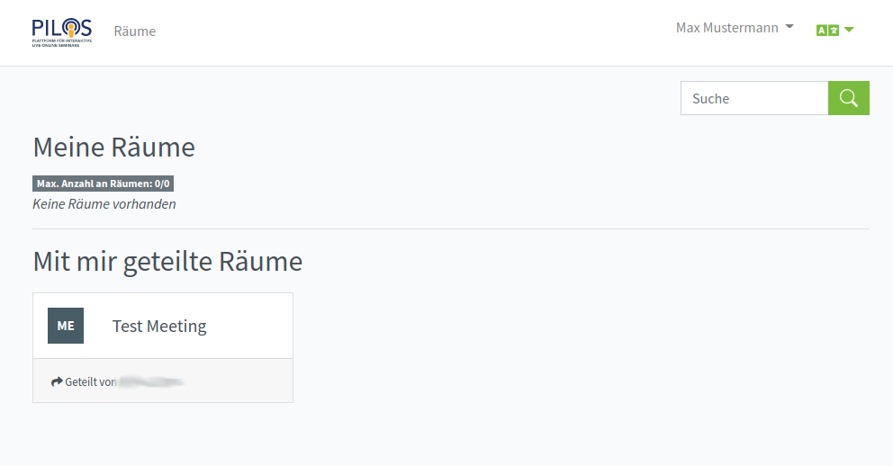
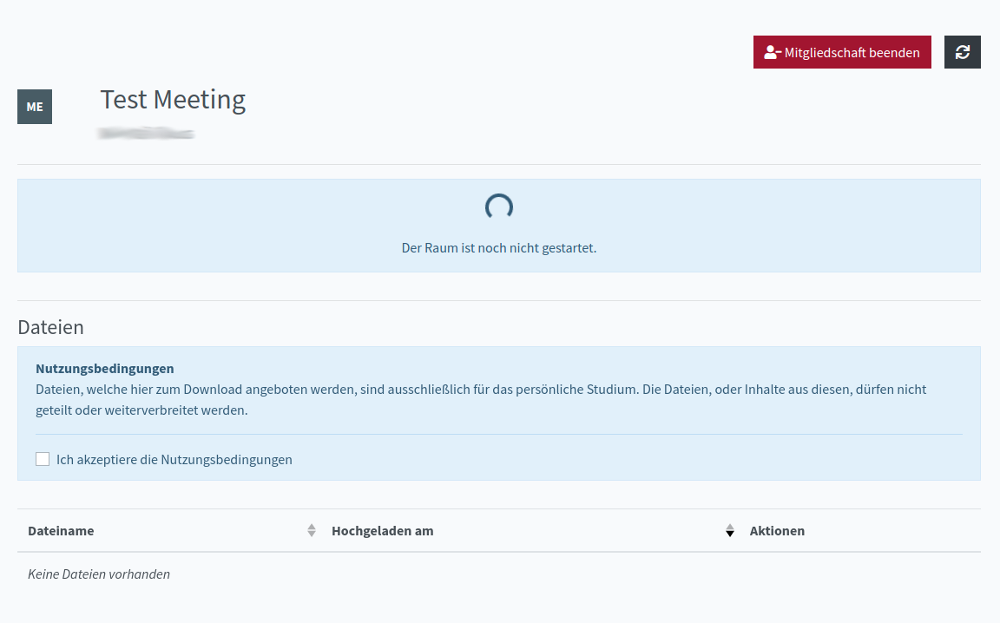
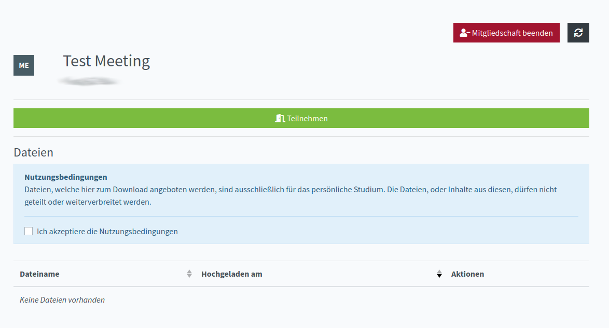

# PILOS-Docs

- [User](##User)
- [Administrator](##Administrator)

## Nutzer

### Home

Wenn man auf seinen Namen rechts oben clickt, kann man sein Profil bearbeiten oder abmelden.

#### Meine Räume
Unter "Meine Räume" werden vom Nutzer erstellte Räume angezeigt.

#### Mit mit geteilte Räume
Hier werden alle Räume angezeigt, zu den der Nutzer eingeladen wurde.

### Meetings
Wenn man auf einen geteilten Raum clickt, kommt man in einen "Wartebereich", wenn der Raum noch nicht vom Besitzer gestartet wurde.

Wenn der Raum schon gestartet ist, darf man sofort daran teilnehmen.

## Räume

## Administrator

