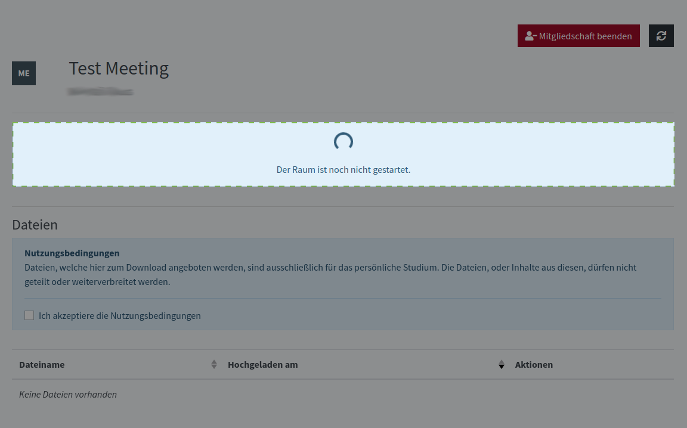
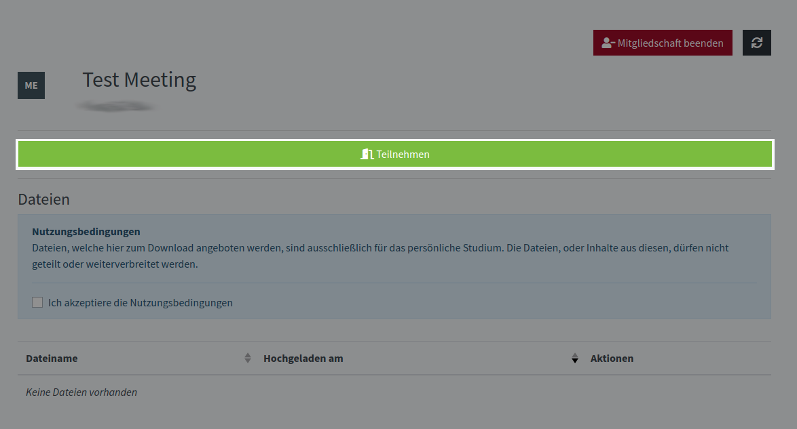
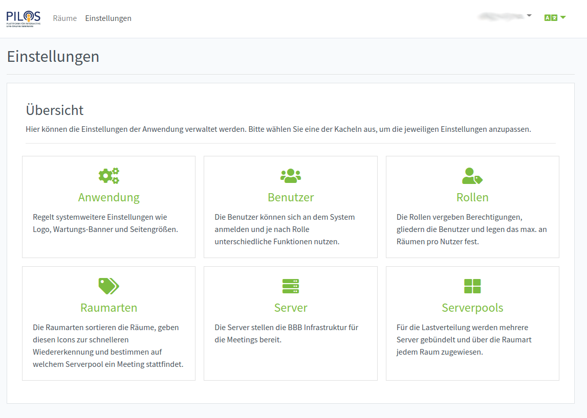
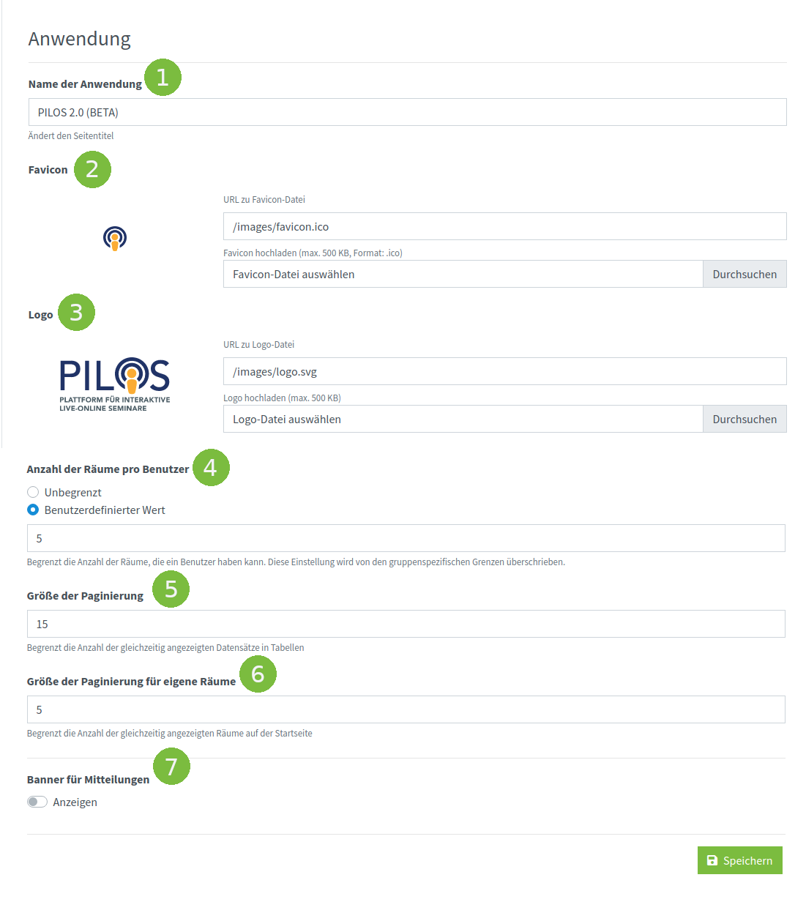
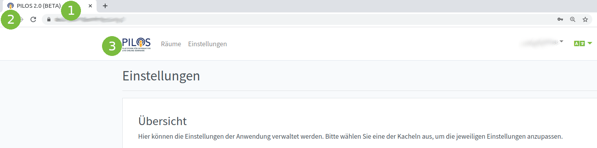
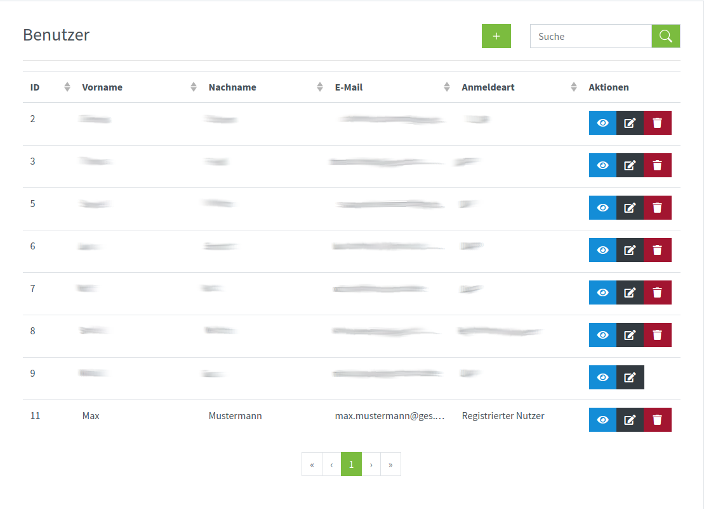

# PILOS-Docs

## Einem Raum beitreten
1. Einen geteilten Raum auswählen.

2. Warten, bis der Raum gestartet wird

3. Auf "Teilnehmen" clicken

## Einen Raum erstellen

## Profil bearbeiten

## PILOS einstellen

Administrator hat Zugriff auf Einstellungen von PILOS.

### Anwendung

1. Name der Anwendungangezeigt

2. Favicon

3. Logo. 

4. Anzahl der Räume pro Benutzer definiert die Standardanzahl der Räume die ein Benutzer erstellen darf. Diese Einstellung wird von Gruppeneinstellungen überschrieben und wird nur dann verwendet, wenn die Gruppeneinstellung nicht vorhanden ist.

### Benutzer

1. Neuen benutzer hinzufügen

2. Detailierte Informationen zum Benutzer

3. Benutzer bearbeiten

4. Benutzer löschen

