# PILOS-Docs

- [User](##User)
- [Administrator](##Administrator)

## Nutzer

### Home

Wenn man auf seinen Namen rechts oben clickt, kann man sein Profil bearbeiten oder abmelden.

#### Meine Räume
Unter "Meine Räume" werden vom Nutzer erstellte Räume angezeigt.

#### Mit mit geteilte Räume
Hier werden alle Räume angezeigt, zu den der Nutzer eingeladen wurde.

### Meetings
Wenn man auf einen geteilten Raum clickt, kommt man in einen "Wartebereich", wenn der Raum noch nicht vom Besitzer gestartet wurde.

Wenn der Raum schon gestartet ist, darf man sofort daran teilnehmen.

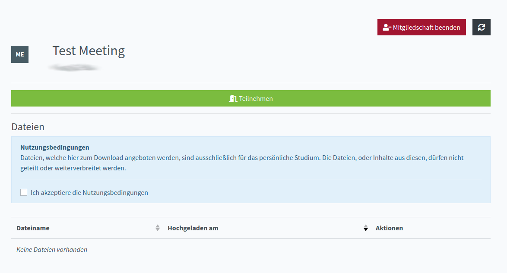

Ein vom Nutzer erstellter Raum sieht so aus.

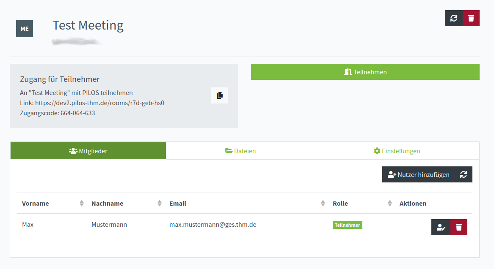

Hier kann man den Raum einstellen oder Mitglieder und Dateien verwalten.

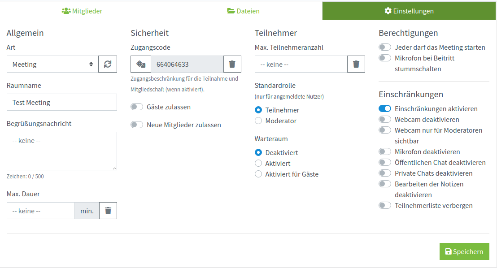

#### Sicherheit
Der Zugangscode wird für den Eintritt in den öffentlichen Raum benötigt. Wenn man jedoch schon Mitglied des Raumes ist, ist der Code nicht nötig.

#### Teilnehmer
In der "Teilnehmer" Sektion kann man die maximale Anzahl an Teilnehmer festlegen, Standardrolle einstellen und Warteraum ein- oder ausschalten.

#### Einschränkungen
Hier kann man bestimmte Funktionen ausschalten, wie z.B. Öffentlicher Chat, Mikrofon oder Webcam.

## Administrator

Administrator hat Zugriff auf Einstellungen von PILOS.

### Anwendung

1. Name der Anwendung wird oben im Browsertab angezeigt

2. Favicon ist ein Icon, der oben im Browsertab angezeigt wird. 

3. Logo wird oben links im Header angezeigt. 

4. Anzahl der Räume pro Benutzer definiert die Standardanzahl der Räume die ein Benutzer erstellen darf. Diese Einstellung wird von Gruppeneinstellungen überschrieben und wird nur dann verwendet, wenn die Gruppeneinstellung nicht vorhanden ist.

### Benutzer

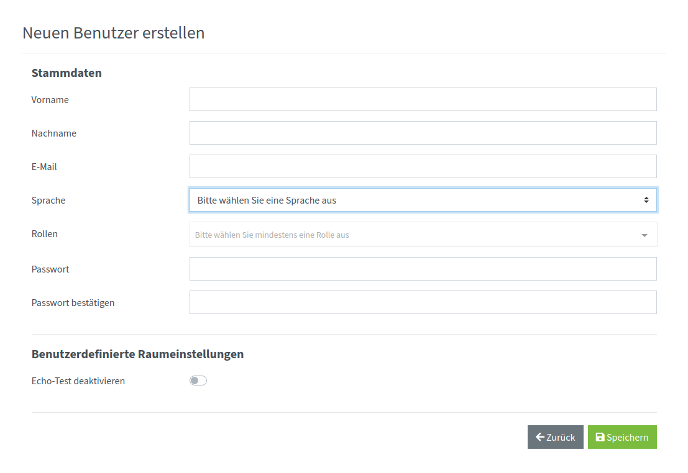

### Rollen
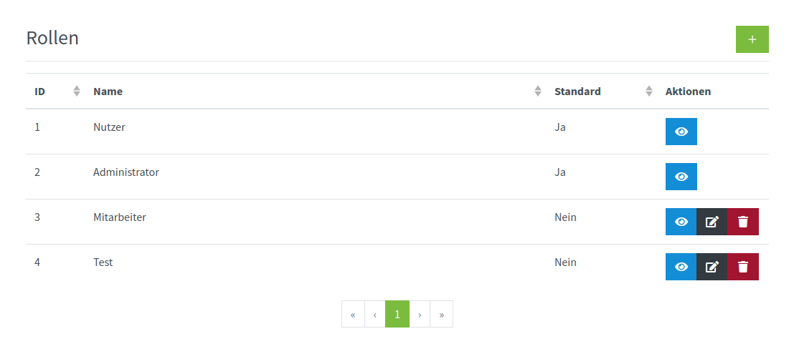
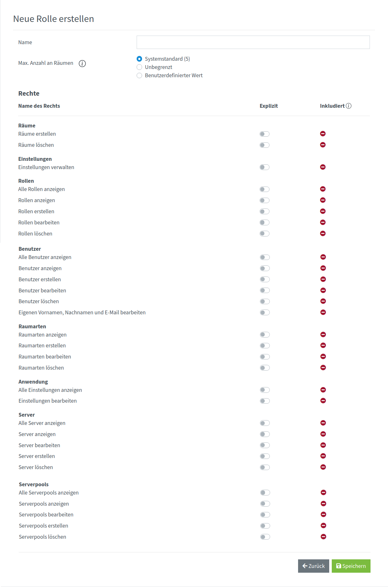

### Raumarten
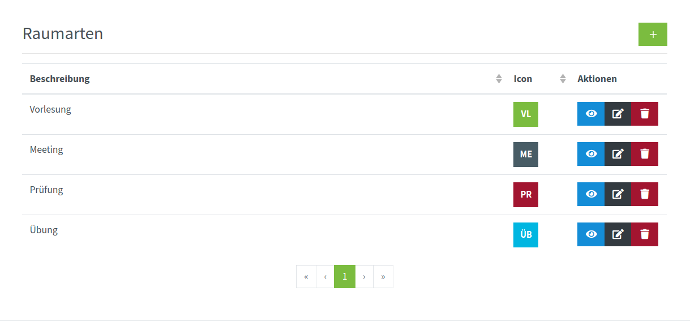
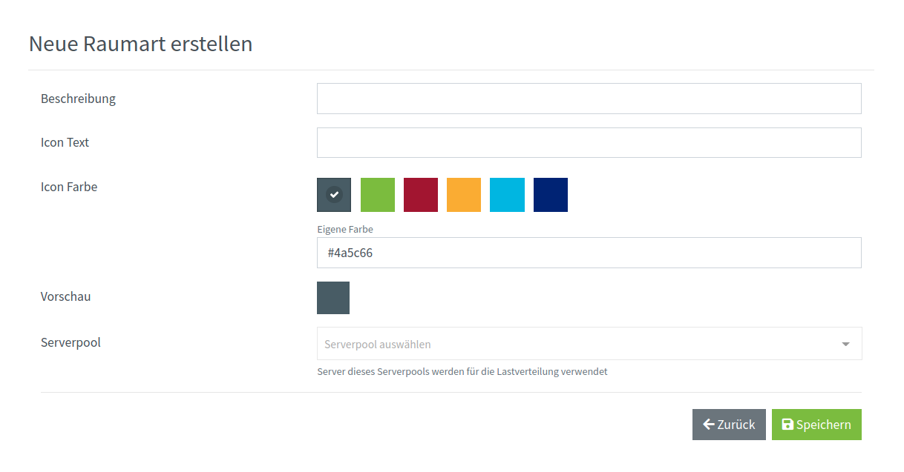

### Server
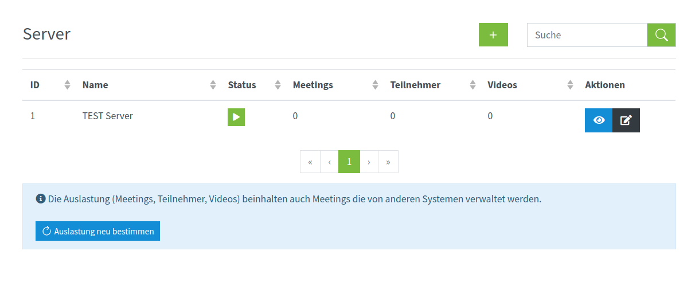
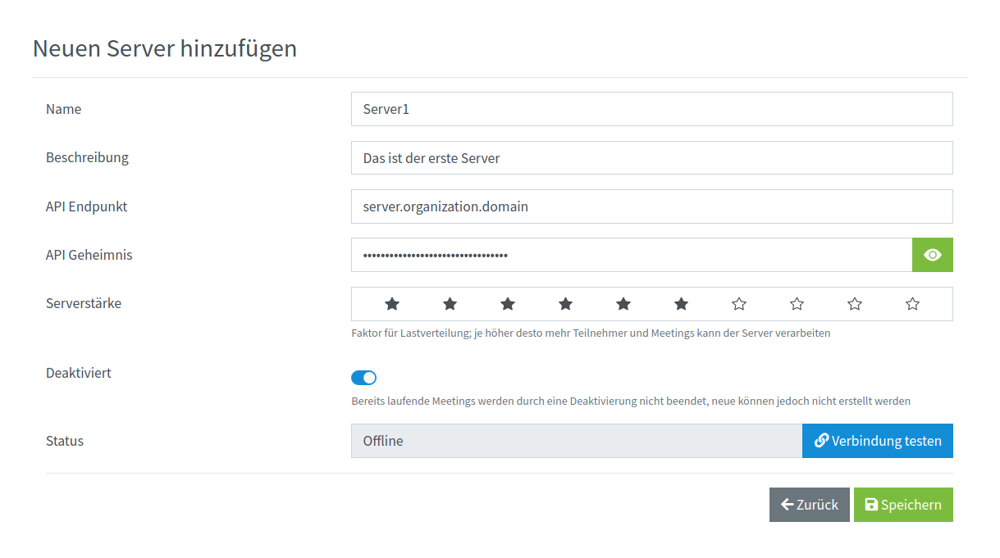

### Serverpools
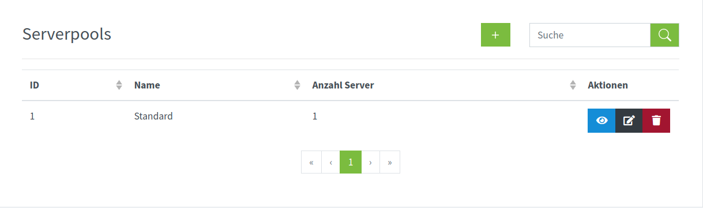
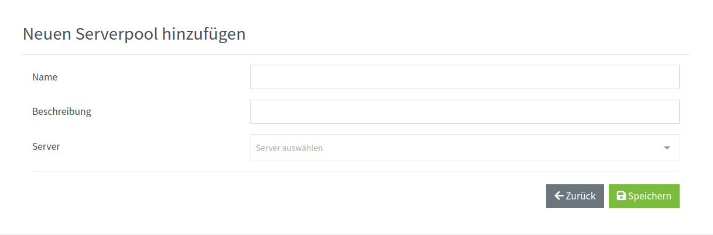

## Räume
In diesem Abschnitt wird die Benutzeroberfläche vom Raum aus der Sichten des Benutzers und des Moderators beschrieben.

### Benutzer

### Moderator

