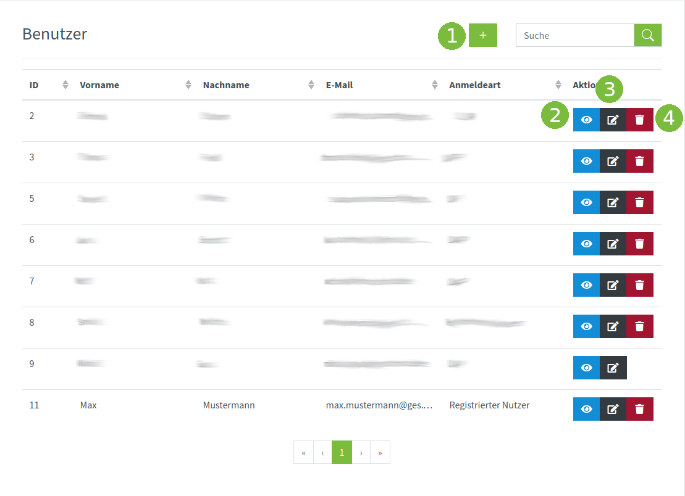

# PILOS-Docs

## Einem Raum beitreten

## Einen Raum erstellen

## Profil bearbeiten

## PILOS einstellen

Administrator hat Zugriff auf Einstellungen von PILOS.

### Anwendung

1. Name der Anwendung wird oben im Browsertab angezeigt

2. Favicon ist ein Icon, der oben im Browsertab angezeigt wird. 

3. Logo wird oben links im Header angezeigt. 

4. Anzahl der Räume pro Benutzer definiert die Standardanzahl der Räume die ein Benutzer erstellen darf. Diese Einstellung wird von Gruppeneinstellungen überschrieben und wird nur dann verwendet, wenn die Gruppeneinstellung nicht vorhanden ist.

5. Maximale Anzahl der Räumen auf einer Seite.

6. Maximale

### Benutzer

1. Neuen benutzer hinzufügen

2. Detailierte Informationen zum Benutzer

3. Benutzer bearbeiten

4. Benutzer löschen

