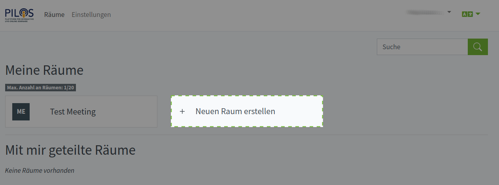
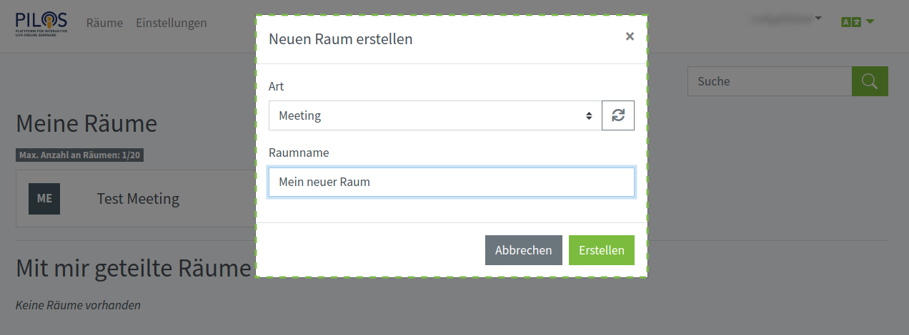

# PILOS-Docs

## Einem Raum beitreten
1. Einen geteilten Raum auswählen.

2. Warten, wenn der Raum noch nicht gestartet wurde.

3. Auf "Teilnehmen" clicken.

## Einen Raum erstellen

1. Auf "Neuen Raum Erstellen" clicken.

2. Raumart auswählen und den Namen vergeben.

3. Teilnehmer einladen.

4. Raum einstellen.

Der Zugangscode wird für Gäste benötigt, falls diese zugelassen sind.

5. Auf "Starten" clicken.

## Profil bearbeiten

## PILOS einstellen

Administrator hat Zugriff auf Einstellungen von PILOS.

### Anwendung

1. Name der Anwendungangezeigt

2. Favicon

3. Logo. 

4. Anzahl der Räume pro Benutzer definiert die Standardanzahl der Räume die ein Benutzer erstellen darf. Diese Einstellung wird von Gruppeneinstellungen überschrieben und wird nur dann verwendet, wenn die Gruppeneinstellung nicht vorhanden ist.

### Benutzer

1. Neuen benutzer hinzufügen

2. Detailierte Informationen zum Benutzer

3. Benutzer bearbeiten

4. Benutzer löschen

