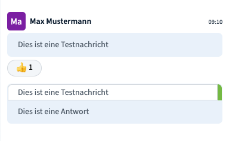
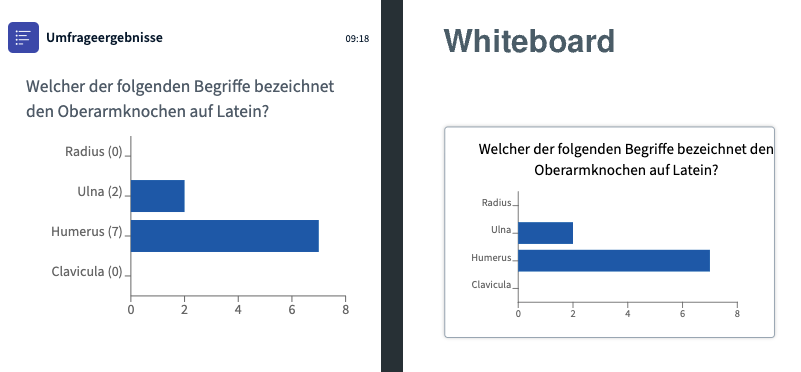
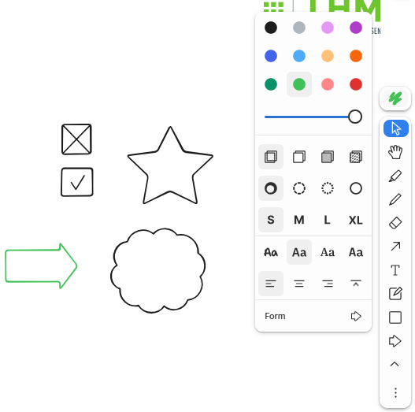
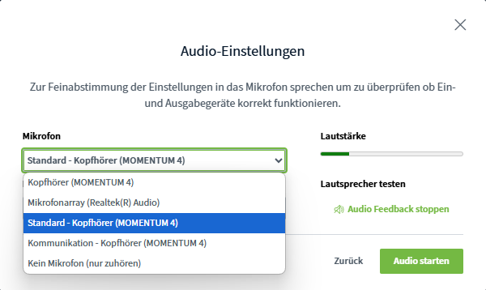
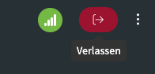
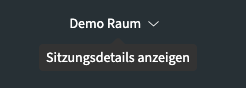
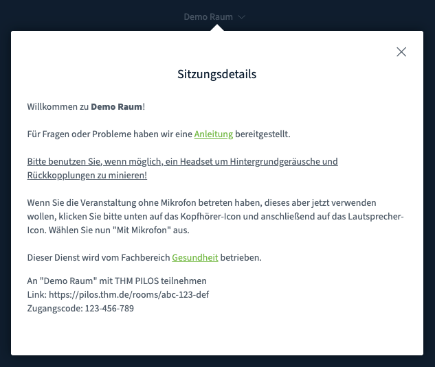
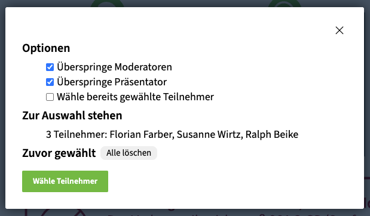
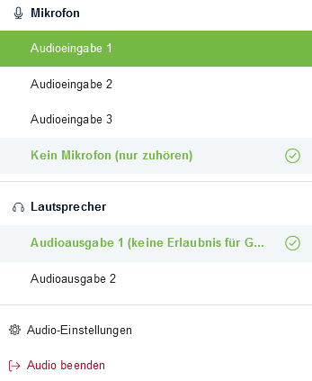

Die PILOS-Plattform wird in Kürze auf BigBlueButton Version 3.0 umgestellt werden.

## Zeitlicher Ablauf
Die neue Version wird zunächst nur für die Raumarten "Meeting", "Digitales Büro" und "Prüfung" aufgespielt.

Zum Ende des Sommersemesters 2025 sollen auch alle übrigen Raumarten auf Version 3.0 umgestellt werden. 

## Was ändert sich?
Die Neuerungen machen die Nutzung von BigBlueButton intuitiver, flexibler und angenehmer – sowohl für Präsentierende als auch für Teilnehmende. Es gibt dabei sowohl die Überarbeitung bereits vorhandener Funktionen, als auch vollständig neue Funktionen.

### Neue Funktionen

#### Verbesserter Chat für mehr Übersicht & Interaktion
- Sie können nun eigene Nachrichten bearbeiten oder löschen – hilfreich bei Tippfehlern oder nachträglichen Korrekturen.

- Mit der neuen Antwortfunktion können Sie direkt auf einzelne Nachrichten reagieren – das macht Diskussionen strukturierter, z. B. bei Rückfragen zu einer älteren Nachricht.

- Außerdem gibt es Emoji-Reaktionen, mit denen Sie schnell Feedback geben können.

#### Verbesserte Darstellung der Umfragen
- Umfrageergebnisse werden jetzt grafisch als Diagramme angezeigt – das sorgt für mehr Klarheit und visuelle Rückmeldung bei Abstimmungen.

#### Neues Whiteboard für kreative Zusammenarbeit
- Das integrierte Whiteboard wurde komplett überarbeitet.

- Sie können nun auch Checkboxen, Hervorhebungen und andere neue Formen verwenden – ideal für Brainstormings, Gruppenarbeiten und Skizzen.

#### Vereinfachte Audio-Steuerung
- Der bisher bekannte Auswahl-Dialog („Mit Mikrofon teilnehmen“ oder „Nur zuhören“) entfällt. Dadurch wird der Beitritt zur Konferenz schneller und unkomplizierter.

- Die Option „Nur zuhören“ finden Sie jetzt im Dropdown-Menü am Mikrofonsymbol – sowohl beim Betreten des Raums als auch jederzeit während der Sitzung.

- Der Wechsel zwischen „Nur Zuhören“ und „Sprechen“ ist jetzt ohne erneutes Betreten des Raums möglich.

- Mikrofone und Audiogeräte lassen sich direkt über das neue Menü am Mikrofon-Symbol auswählen.

#### Vereinfachte Benutzeroberfläche
- Die Buttons „Hand heben“ und „Meeting verlassen“ sind nun klar sichtbar und leichter erreichbar.

- Begrüßungs- und Sitzungsinformationen können nun jederzeit über eine Schaltfläche im oberen Bereich angezeigt werden, unabhängig vom geöffneten Chat.

#### Neue Optionen für "Zufälligen Teilnehmer"

- Die Funktion zur Auswahl eines zufälligen Teilnehmers wurde um weitere Optionen ergänzt: So können Sie nun beispielsweise festlegen, ob Moderatoren und der Präsentator in die Auswahl einbezogen werden sollen und ob bereits ausgewählte Teilnehmer erneut ausgewählt werden können.

## Was noch nicht perfekt ist - bekannte Einschränkungen
Auch wenn BigBlueButton 3.0 viele neue Funktionen bringt, möchten wir Sie offen auf einige derzeit bekannte Einschränkungen hinweisen:

- Teilweise fehlende Übersetzungen: Die deutsche Sprachversion ist noch nicht vollständig übersetzt. Einzelne Menütexte oder Meldungen erscheinen (noch) auf Englisch.

- Whiteboard & Präsentation: In manchen Fällen kommt es beim Zoomen oder beim Wechseln zwischen Folien zu kleinen Darstellungsfehlern oder ungewollten „Sprungeffekten“.

#### Probleme mit Firefox

- Teilweise werden Mikrofone nur als „Audio input 1“, „2“ etc. angezeigt, was die Auswahl erschwert. Falls dies auftritt lässt sich das korrekte Gerät durch Ausprobieren in den Audio-Einstellungen dennoch leicht identifizieren.

- Kamera oder Bildschirmfreigabe funktionieren gelegentlich nicht zuverlässig – hier hilft meist ein Wechsel zu Chrome oder Edge.

Wir beobachten diese Punkte aufmerksam und halten die Plattform mit Sicherheits- und Funktionsupdates auf dem aktuellen Stand. Bei Fragen oder technischen Schwierigkeiten helfen wir Ihnen gerne weiter.

**Tipp:** Für die beste Nutzererfahrung empfehlen wir zum aktuellen Zeitpunkt die Verwendung von Google Chrome oder anderen auf Chrome-basierten Browsern.

**Bei Fragen oder Feedback zur neuen Version wenden Sie sich gerne an unser Support-Team.**