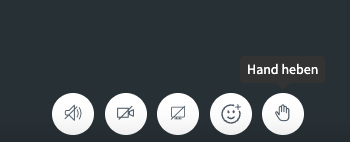

Die PILOS Plattform wird in Kürze auf die BigBlueButton Version 3.0 umgestellt werden.

## Zeitlicher Ablauf
Dies betrifft zunächst nur die Raumarten "Meeting", "Digitales Büro" und "Prüfung".

Geplant ist, dass zum Ende des Sommersemesters 2025 alle verbleibenden Raumarten ebenfalls auf die BigBlueButton Version 3.0 umgestellt werden.

## Was ändert sich?

### Neue Funktionen

#### Verbesserter Chat für mehr Übersicht & Interaktion
Sie können nun eigene Nachrichten bearbeiten oder löschen – praktisch bei Tippfehlern oder unklaren Formulierungen.

Mit der neuen Antwortfunktion können Sie direkt auf einzelne Nachrichten reagieren – das macht Diskussionen strukturierter.

Außerdem gibt es Emoji-Reaktionen, mit denen Sie schnell Feedback geben können.

#### Verbesserte Darstellung der Umfragen
Umfrageergebnisse werden jetzt grafisch als Diagramme angezeigt – das sorgt für mehr Klarheit und visuelle Rückmeldung bei Abstimmungen.

#### Neues Whiteboard für kreative Zusammenarbeit
Das integrierte Whiteboard wurde komplett überarbeitet.

Sie können nun auch Checkboxen, Hervorhebungen und andere neue Formen verwenden – ideal für Brainstormings, Gruppenarbeiten und Skizzen.

#### Vereinfachte Audio-Steuerung
Der Wechsel zwischen „Nur Zuhören“ und „Sprechen“ ist jetzt ohne erneutes Betreten des Raums möglich.

Mikrofone und Audiogeräte lassen sich direkt über das neue Menü am Mikrofon-Symbol auswählen.

#### Vereinfachte Benutzeroberfläche
Die Buttons „Hand heben“ und „Meeting verlassen“ sind nun klar sichtbar und leichter erreichbar.

Begrüßungs- und Sitzungsinformationen können jederzeit, unabhänig vom Chat angezeigt werden.

