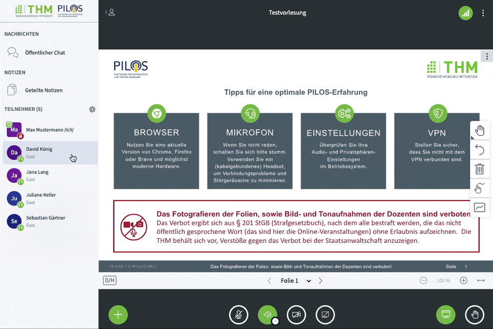
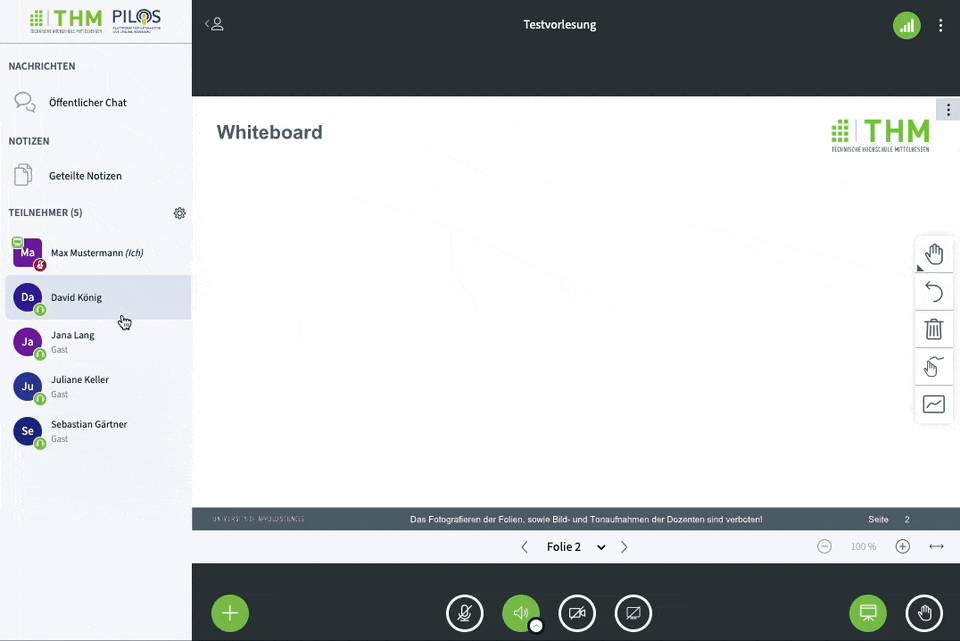
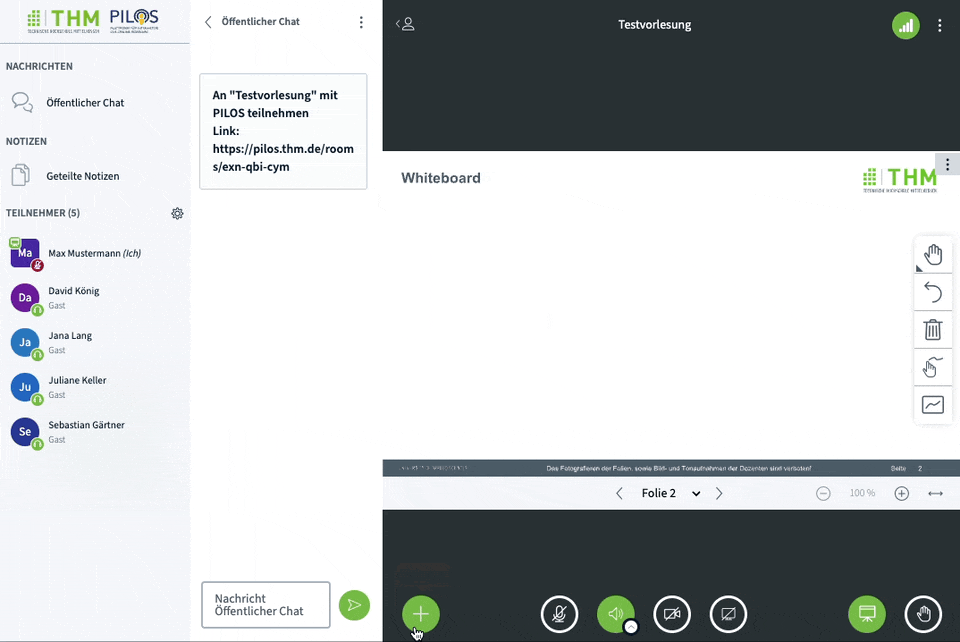
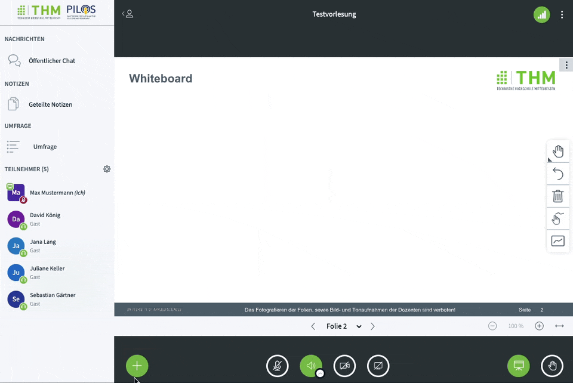
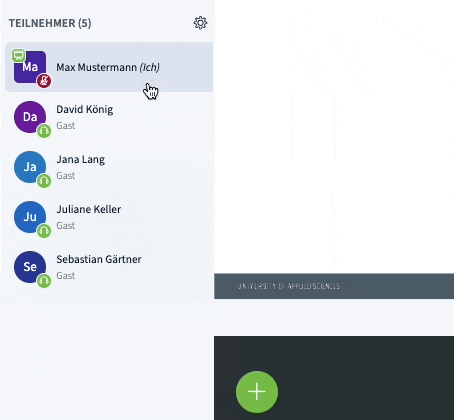
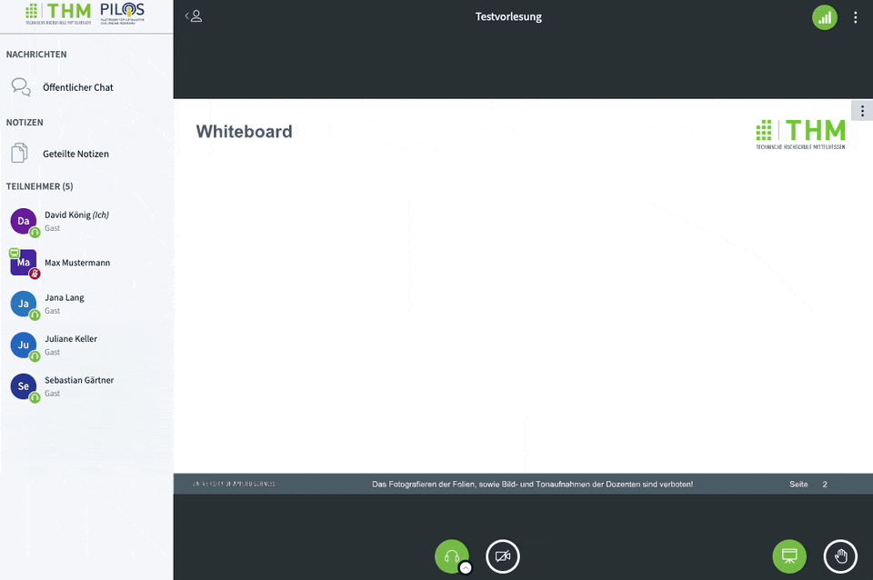
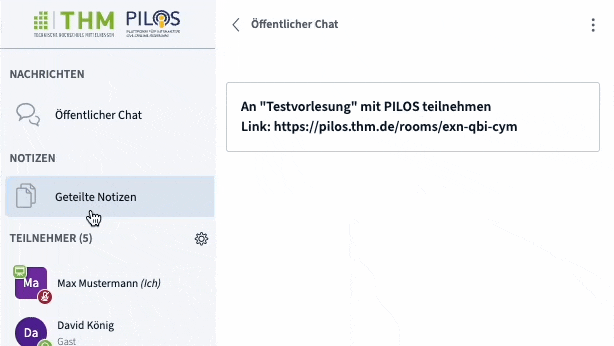

## Überblick

- **A**: Chat öffnen, wird in Bereich D angezeigt
- **B**: Geteilte Notizen öffnen, wird in Bereich D angezeigt
- **C**: Teilnehmerliste und Einstellungen
- **D**: Bereich für Chat oder Geteilte Notizen
- **E**: Titel, Verbindungsstatus und Einstellungen
- **F**: Präsentationsfläche, Video und Bildschirmfreigabe
- **G**: Audio, Video und Präsentationsmenü

## Rollen
### Moderator

Moderatoren verwalten die Videokonferenz während der Durchführung und besitzen alle Rechte.
Es können beliebig viele Teilnehmer Moderatoren sein.

Ein Moderator kann:
- Sich selbst und andere zum Präsentator ernennen
- Teilnehmer stumm schalten/entfernen
- Die Rechte der Teilnehmer einschränken
- Teilnehmer verwalten
- Breakout-Räume eröffnen
- Die Konferenz beenden

### Präsentator

Der Präsentator hat weniger Befugnisse als der Moderator. Diese Rolle kann ohne Risiko an präsentierende Teilnehmer übertragen werden.
Im Gegensatz zu Moderatoren kann es nur einen Präsentator geben. Der erste Moderator in einem Raum ist automatisch Präsentator.

Ein Präsentator kann:
- Eine Umfrage starten
- Das Whiteboard verwenden
- Eine Präsentation hochladen
- Seinen Bildschirm teilen
- Ein externes Video teilen

### Teilnehmer

Der Teilnehmer nimmt ohne besondere Berechtigungen an der Videokonferenz teil.

Ein Teilnehmer kann:
- Seine Webcam teilen
- Über das Mikrofon sprechen
- Mit Emojis reagieren und die Hand heben
- Nachrichten im öffentlichen Chat schreiben
- Nachrichten in privaten Chats an einzelne Nutzer
- An Umfragen teilnehmen
- Die geteilten Notizen bearbeiten

:::tip Tipp

Die meisten dieser Teilnehmerrechte können eingeschränkt werden. [Mehr dazu](#teilnehmerrechte-einschränken)

:::

### Gast

Gäste sind Teilnehmer, welche ohne Nutzung eines Benutzerkontos an der Videokonferenz teilnehmen.

:::warning Achtung

Der angezeigte Name ist nicht durch die Verwaltungslösung PILOS verifiziert.

:::

### Rolle ändern

#### Präsentator

Als Moderator können Sie die Rolle des Präsentators an Teilnehmer geben, indem Sie in der Teilnehmerliste auf den Namen des Teilnehmers klicken und "Zum Präsentator machen" auswählen.

Um selber wieder Präsentator zu sein, können Sie als Moderator auf Ihren eigenen Namen klicken und "Zum Präsentator werden" auswählen.
Alternativ können Sie auch unten auf das Plus-Symbol klicken und dort "Zum Präsentator werden" auswählen.

#### Moderator

Als Moderator können Sie andere Teilnehmer zu Moderatoren befördern.

Klicken Sie dafür in der Teilnehmerliste auf den Namen des Teilnehmers und wählen "Zum Moderatoren ernennen" aus.

Um den Teilnehmer wieder zu einem normalen Teilnehmer zu machen, klicken Sie erneut auf den Namen in der Teilnehmerliste und wählen "Zum Teilnehmer zurückstufen" aus.

:::note Gäste

Aus Sicherheitsgründen können Gäste nicht zu Moderatoren befördert werden.

:::

:::warning Achtung

Die Rolle des Moderators sollte bedacht vergeben werden, da jeder Moderator die folgenden Aktionen ausführen kann:

- Sich selber und andere zum Präsentator ernennen
- Moderatoren ernennen und zurückstufen (auch Dozenten die Moderatoren-Rolle entziehen)
- Teilnehmer (auch Dozenten) stumm schalten/entfernen
- Teilnehmer aus dem Raum entfernen (auch Dozenten)
- Breakout Räume eröffnen
- Die Konferenz beenden

:::

### Teilnehmerrechte einschränken

Die Berechtigungen von Teilnehmern und Gästen können von Moderatoren eingeschränkt werden.
Klicken Sie dafür in der Teilnehmerliste auf das Zahnrad-Symbol und anschließend auf "Teilnehmerrechte einschränken".

In dem Dialogfenster können Sie dann unterschiedliche Programmfunktionen für Teilnehmer einschränken. Mit einem Klick auf "Anwenden" werden diese Regeln aktiv.

:::tip

Sie können diese Einschränkungen zum Teil auch schon im vorhinein in PILOS konfigurieren. [Mehr Erfahren](../room/settings.mdx#einschränkungen)

:::

## Teilnehmerliste

In der Teilnehmerliste werden alle Nutzer angezeigt, die aktuell an der Videokonferenz teilnehmen.

Die Form der Icons und Symbole hat dabei eine Bedeutung für die Rolle und den Audiostatus.

### Rolle
- **Moderator**: Eckiges Icons (1)
- **Präsentator**: Whiteboard-Icon oben links (1)
- **Teilnehmer**: Rundes Icons (2,3,4)
- **Gast**: Unterhalb des Namens wird "Gast" angezeigt

### Audiostatus
- **Mit Mikrofon**: Grünes Mikrofon-Icon unten rechts (1)
- **Mit stumm geschaltetem Mikrofon**: Rotes durchgestrichenes Mikrofon-Icon unten rechts (3)
- **Ohne Mikrofon**: Grünes Kopfhörer-Icon unten rechts (2)
- **Ohne Audioverbindung**: Leeres Icon unten rechts (4)

:::tip Shortcut Tipp
Teilnehmerliste kann mit <kbd>Alt</kbd> + <kbd>U</kbd> (Windows) / <kbd>⌃ Control</kbd> + <kbd>⌥ Option</kbd> + <kbd>U</kbd> (Mac) geöffnet oder geschlossen werden.
:::

## Medien
### Audio

Die Audiokonferenz bietet Ihnen zwei unterschiedliche Arten der Teilnahme. Sie können entweder mit Mikrofon teilnehmen oder nur Zuhörer sein.

Wenn Sie einer Konferenz beitreten, müssen Sie sich zunächst für eine der beiden Optionen entscheiden.
Wählen Sie den Betritt mit einem Mikrofon, können Sie anschließend die Audioverbindung testen. Sollten Sie sich nicht verstehen, klicken Sie auf "Nein" umd die Audiogeräte zu konfigurieren.

#### Stummschalten / Freischalten

Wenn Sie gerade nichts sagen, schalten Sie am besten Ihr Mikrofon stumm.
Das können Sie unten über einen Klick auf das Mikrofon-Symbol erreichen. Durch einen erneuten Klick ist das Mikrofon wieder aktiv.
Ist das Symbol grün, ist das Mikrofon aktiv, ist es grau und durchgestrichen ist es stumm. Auch in der Teilnehmerliste wird neben Ihrem Namen der Zustand des Mikrofons angezeigt.

:::tip Shortcut Tipp

Sie können das Mikrofon mit <kbd>Alt</kbd> + <kbd>M</kbd> (Windows) / <kbd>⌃ Control</kbd> + <kbd>⌥ Option</kbd> + <kbd>M</kbd> (Mac) an- und ausschalten.

:::

#### Audiogeräte wechseln
Wenn Sie die Audiogeräte wechseln möchten, klicken Sie unten neben dem Lautsprechersymbol auf den kleinen Pfeil.
Haben Sie ohne Mikrofon teilgenommen, ist das Lautsprechersymbol ein Kopfhörersymbol.

Währen Sie aus der Liste das gewünschte Audiogerät aus.

#### Audio verlassen / beitreten

Um den aktuellen Zustand der Audiokonferenz zu verändern, klicken Sie Lautsprecher- oder Kopfhörer-Symbol.
Anschließend können Sie über einen erneuten Klick auf das Symbol der Audiokonferenz wieder beitreten.
Hier müssen Sie erneut die Art der Teilnahme (Zuhören oder Mikrofon) auswählen.

:::tip Shortcut Tipp

Sie können das Audio mit <kbd>Alt</kbd> + <kbd>J</kbd> (Windows) / <kbd>⌃ Control</kbd> + <kbd>⌥ Option</kbd> + <kbd>J</kbd> (Mac) starten und mit <kbd>Alt</kbd> + <kbd>L</kbd>(Windows) / <kbd>⌃ Control</kbd> + <kbd>⌥ Option</kbd> + <kbd>L</kbd> (Mac) stoppen.

:::

### Webcam

Um Ihre Webcam zu teilen, klicken Sie am unteren Bildschirmrand auf das Webcam-Symbol.
Es öffnet sich ein neues Fenster, in dem Sie die gewünschte Kamera und die Qualität der Videoübertragung einstellen können.

:::tip
Wenn Sie nur über eine geringe Bandbreite verfügen, wählen Sie lieber eine geringere Qualität, da es sonst zu Problemen mit der Audio- oder Videoübertragung kommen kann.
:::

#### Virtueller Hintergrund

Zur Wahrung Ihrer Privatsphäre können Sie den Hintergrund Ihres Webcam-Bildes verändern.
Neben der Auswahl verschiedener Hintergründe können Sie auch den Hintergrund weichzeichnen lassen.

Um den virtuellen Hintergrund wieder zu entfernen, klicken Sie auf das Bild mit dem "X".
Sie können jederzeit den Hintergrund ändern, klicken Sie dafür am unteren Bildschirmrand auf den kleinen Pfeil neben dem Webcam-Symbol.

#### Weitere Kamera teilen

Um weitere Inhalte und Personen zu zeigen, kann die Verwendung mehrerer Kameras hilfreich sein. Sie können über den kleinen Pfeil neben dem Video-Symbol die Einstellungen der Kamera öffnen.
Wählen Sie aus dem Drop-Down die weitere Kamera aus und klicken auf "Freigabe starten".

Um die Kamera wieder zu beenden, klicken Sie erneut auf den Pfeil neben dem Video-Symbol, wählen die Kamera aus und klicken auf "Teilen beenden".

### Whiteboard

:::note Hinweis

Diese Funktion kann nur von dem Moderator verwendet werden

:::

Das Whiteboard ermöglicht Ihnen das Zeichen und Schreiben, sowie das Zeigen von Präsentationsinhalten.

Um Folien hochzuladen, drücken Sie auf das Plus-Symbol unten links, dann auf "Präsentationen verwalten".
Wählen Sie nun eine Datei von Ihrer Festplatte aus oder ziehen diese in das Drag and Drop Feld.
Anschließend können Sie noch festlegen, ob die Teilnehmer die Präsentation herunterladen dürfen (Download-Icon) und welches die aktive Präsentation ist (Kreis mit Häkchen).

:::tip Office Dateien

Office Dateien, die Sie in einem Meeting nutzen wollen (Word, Excel, PowerPoint) werden mit einer Version von Open Office in Vektorgrafiken umgewandelt. Dabei gehen alle Animationen und Übergänge verloren.
Werden bestimmte Funktionen von der Open Office Version nicht unterstützt, kann auch die Darstellung eingeschränkt sein.

**Es wird dringend empfohlen Vorlesungsfolien vor dem Hochladen, als PDF Datei abzuspeichern und diese hochzuladen.**

:::

:::tip Folien im Vorhinein hochladen

Sie können Ihre Folien im vorhinein in PILOS hochladen, verwalten und zum Download anbieten.
[Mehr erfahren](room/functions/files.md#ansicht-für-raumeigentümer)

:::

:::caution Achtung

Der Präsentator hat Zugriff auf alle Präsentationen, die im Laufe der Videokonferenz hochgeladen und noch nicht gelöscht wurden.

:::

#### Präsentation wechseln

Haben Sie mehrere Präsentationen hochgeladen, können Sie zwischen diesen wechseln.
Klicken Sie dafür aus das Plus-Symbol unten links und wählen die gewünschte Präsentation aus.

### Bildschirmfreigabe

:::note Hinweis

Diese Funktion kann nur von dem Moderator verwendet werden

:::

Da nicht alle Inhalte über Folien präsentiert werden können, gibt es die Möglichkeit den Bildschirm zu teilen.
Sie dabei die Wahl zwischen Tabs Ihres Webbrowsers, Anwendungsfenstern und dem gesamten Bildschirm. Welche Optionen es gibt und wie die Auswahl erfolgt ist abhängig von Ihres Webbrowser und dem Betriebssystem.

:::info

Das Teilen des Bildschirms ist auf mobilen Geräten (iOS und Android) aufgrund von Beschränkungen der Browser aktuell nicht möglich. Eine App für BigBlueButton ist in Arbeit.

:::

### Video teilen

:::note Hinweis

Diese Funktion kann nur von dem Moderator verwendet werden

:::

Um ein öffentlich verfügbares Video zu zeigen, benötigen Sie den Link zu dem Video.
Aktuell werden folgende Links unterstützt:
- YouTube
- Vimeo
- Instructure Media
- Twitch
- Dailymotion
- Direkte Links zu .mp4 Dateien auf einem Server (NextCloud und Hessenbox werden nicht unterstützt)

Klicken Sie unten links auf das Plus-Symbol und wählen die Option "Externes Video teilen" aus.
Fügen Sie in dem neuen Fenster den Link zu dem Video ein und klicke auf "Neues Video teilen".

Um das Teilen des Videos für alle zu beenden, klicken Sie erneut auf das Plus-Symbol und wählen "Teilen von externem Video beenden" aus.

## Interaktion

### Chat

:::tip Shortcut Tipp
  Sie können die Nachricht auch mit <kbd>⏎ Enter</kbd>  senden.
:::

Über den öffentlichen Chat können Sie Nachrichten zwischen allen Nutzern austauschen. Klicken Sie dafür auf der linken Seite auf "Öffentlicher Chat" um den Chat ein- oder auszublenden.
Unten können Sie Nachrichten eingeben und mit einem Klick auf das Pfeil-Symbol abschicken. Nachrichten von Moderatoren sind im Chat mit einer dicken Schriftart besonders hervorgehoben.

#### Chatverlauf kopieren, speichern, löschen

Mit dem Klick rechts oben im Chat auf die drei Punkte kann der Chatverlauf gespeichert, kopiert oder gelöscht werden.

#### Privater Chat

Um nur einer Person eine Nachricht zu schicken, können Sie auf den Namen der Person in der Teilnehmerliste klicken und anschließend "Privaten Chat starten" auswählen.
Es wird ein neuer Chat mit dieser Person erstellt. Auf der linken Seite können Sie jederzeit zwischen den privaten Chats und dem öffentlichen Chat wechsel.

Wenn Sie in einem anderen Chat eine neue Nachricht erhalten haben, wird das über ein kleines rotes Symbol angezeigt.

### Umfragen

:::note Hinweis

Diese Funktion kann nur von dem Moderator verwendet werden

:::

Umfragen sind eine gute Möglichkeit mit dem Publikum zu interagieren und dieses zu aktivieren.

Um eine neue Umfrage zu starten, klicken Sie auf das Plus-Symbol und anschließend auf "Umfrage starten".

Sie können nun die Frage oben in das Feld eingeben und ein paar Voreinstellungen für die Antwortmöglichkeiten auswählen.
Möchten Sie lieber keine Antwortmöglichkeiten vorgeben, wählen Sie "Teilnehmerantwort" aus, sodass die Teilnehmer eine Antwort eintippen müssen.
Wenn Sie eine der Voreinstellungen ausgewählt haben, können Sie die Antwortmöglichkeiten auch verändern und weitere Optionen hinzufügen.

### Anonyme Umfrage
Standardmäßig können Sie die Antworten den Teilnehmer zuordnen, um so bspw. individuell auf die Teilnehmer einzugehen und diese weiter zu fördern.
Möchten Sie dies jedoch nicht oder beeinflusst das die Teilnahme oder das Abstimmungsverhalten, können Sie die Umfrage über den Schalter "Anonyme Umfrage" auch so durchführen, dass Sie die Namen nicht angezeigt bekommen.
Wenn die Umfrage anonym durchgeführt wird, bekommen die Teilnehmer das durch eine Textmeldung angezeigt.

:::caution Achtung

Das System erlaubt zurzeit keine echten anonymen Umfragen. Serverseitig können mit technischem Aufwand die Teilnehmer und die Antworten verknüpft werden.
Über die Benutzeroberfläche haben die Moderatoren und Präsentatoren jedoch **nicht** die Möglichkeit die Namen einer anonymen Umfrage zu rekonstruieren.

**Der Einsatz bei Wahlen (Schutz des Wahlgeheimnisses) ist daher nicht zulässig.**

:::

### Zufallsgenerator

:::note Hinweis

Diese Funktion kann nur von dem Moderator verwendet werden

:::

Zur Vorstellung von Ergebnissen nach einer Arbeitsphase oder zur aktivierung der Teilnehmer, können Sie einen Teilnehmer zufällig auswählen lassen.
Der Prozess ist dabei für alle sichtbar und nachvollziehbar.

Um einen zufälligen Teilnehmer auszuwählen, klicken Sie auf das Plus-Symbol und anschließend auf "Zufälligen Teilnehmer auswählen".

:::info

Es werden nur Teilnehmer und Gäste in der Auswahl berücksichtigt (keine Moderatoren).

:::

### Emojis

Mit Emojis können Sie auf Ereignisse im Raum reagieren.

Dafür klicken Sie auf Ihren Namen links in der Teilnehmerliste und wählen Sie "Status setzen" aus.
Anschließend können Sie einen der verfügbaren Emojis auswählen.

Um das Emoji wieder zu entfernen, klicken Sie erneut auf Ihren Namen und wählen "Status zurücksetzen" aus.

### Hand heben

Sie können in der Videokonferenz ihr Hand heben, um bspw. eine Frage zu stellen. Klicken Sie dafür unten rechts in der Ecke auf den Button mit dem Hand-Symbol.
Um Ihre Hand wieder zu senken, klicken Sie erneut auf den Button. Ist der Button grün, haben Sie Ihre Hand aktuell gehoben.

Der Präsentator und die Moderatoren bekommen oben rechts angezeigt, welche Personen Ihre Hand gehoben haben.
Durch Klicken auf die Icons der Teilnehmer, können die Hände einzelner Teilnehmer gesenkt werden.
Alternativ können über den Button "Hände senken" auch alle Hände gesenkt werden.

### Geteilte Notizen

Geteilte Notizen können verwendet werden, um gemeinsam Notizen für die Besprechung zu erstellen.
Um diese zu öffnen, klicken Sie auf "Geteilte Notizen" links oberhalb der Teilnehmerliste.

Editieren mehrere Teilnehmer gleichzeitig die Notizen, werden Ihnen die Namen in der jeweiligen Zeile angezeigt.

:::tip Tipp
Sie können die Bearbeitung der geteilten Notizen durch die Teilnehmer einschränken.
[Mehr dazu](#teilnehmerrechte-einschränken)

:::

Die Notizen können Sie jederzeit herunterladen. Klicken Sie dafür auf das "Download"-Symbol rechts oben im Fenster "Geteilte Notizen".
Anschließend können Sie das gewünschte Format auswählen.

## Warteraum

:::note Unvollständig

Die Dokumentation ist hier noch unvollständig und wird noch ergänzt

:::

## Gruppenräume

:::note Unvollständig

Die Dokumentation ist hier noch unvollständig und wird noch ergänzt

:::
