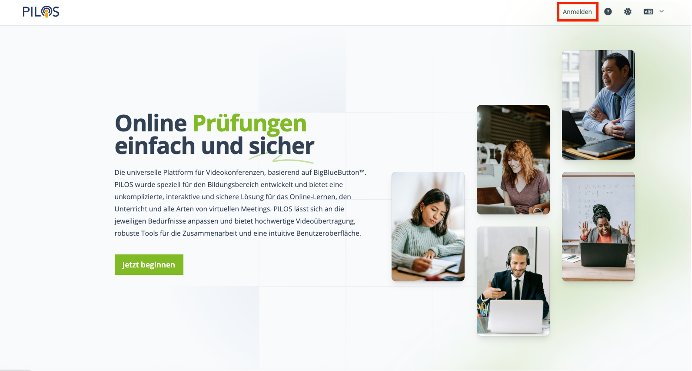
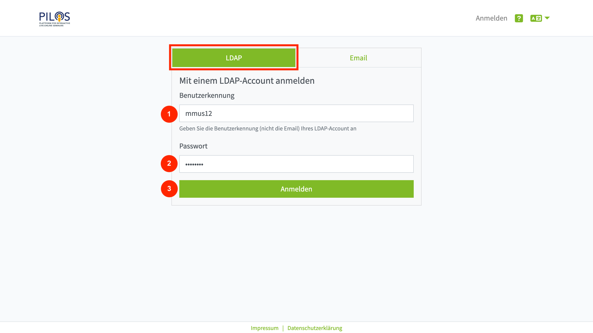
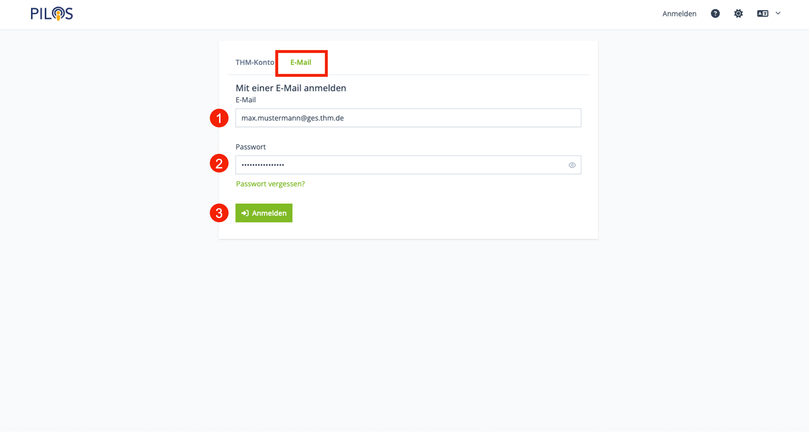
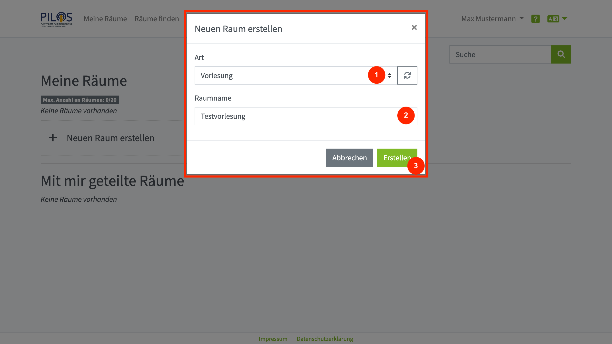
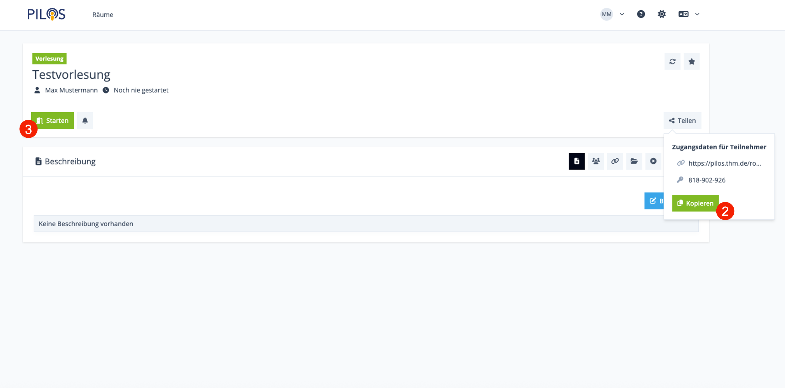

import Tabs from '@theme/Tabs';
import TabItem from '@theme/TabItem';

## Einleitung

Herzlich willkommen zur Videokonferenzplattform PILOS an der THM. Diese Kurzanleitung soll Ihnen einen schnellen Einstieg ermöglichen und zeigen, wie Sie einen neuen Raum erstellen können.

## 1. Anmelden

Klicke Sie oben rechts in der Ecke auf "Anmelden".

Wählen Sie anschließend Ihre Anmeldeart aus.
Wenn Sie Student oder Mitarbeiter an der THM sind, können Sie sich mit Ihrer THM Benutzerkennung und Ihrem Passwort über die Anmeldeart "LDAP" anmelden.

<Tabs>
  <TabItem value="ldap" label="LDAP" default>
   Tragen Sie Ihre THM-Benutzerkennung und Ihr zugehöriges Passwort in die Eingabemaske (1-2) ein und klicken anschließend auf "Anmelden" (3).

   

  </TabItem>
  <TabItem value="email" label="Email">
   Wenn Sie keine THM Benutzerkennung haben oder Sie Problem mit dem LDAP Login haben, kann das Support-Team Ihnen ein Benutzerkonto für den Email Login erstellen.
     
   Sollten Sie Ihr Passwort vergessen haben, können Sie sich mit einem Klick auf “Passwort vergessen?” einen Link für die Passwortzurücksetzung an Ihre eMail-Adresse schicken lassen.
     
   Tragen Sie Ihre Email und Ihr zugehöriges Passwort in die Eingabemaske (1-2) ein und klicken anschließend auf "Anmelden" (3).

   
  </TabItem>
</Tabs>

## 2. Raum erstellen

Sie befinden Sie nun auf Ihrer persönlichen Startseite, auf welcher Sie Ihre eigenen Räume finden.
Weiterhin werden Ihnen hier auch Ihre Raummitgliedschaften angezeigt.

Um einen neuen Raum zu erstellen, klicken Sie unter dem Abschnitt “Meine Räume” auf “Neuen Raum erstellen”.

In dem sich öffnenden Popup-Fenster wählen Sie die gewünschte Raumart (1) aus, legen einen Namen für den Raum fest (2) und klicken auf “Erstellen” (3).

## 3. Raum starten

Der neue Raum wurde erstellt und Sie können diesen nun verwenden.
Um den Raum mit weiteren Nutzern zu teilen, klicken Sie auf den Kopieren-Button (1) und verteilen die kopieren Informationen beispielsweise per E-Mail.

Wenn Sie den Videokonferenzraum starten möchten, klicken Sie auf "Starten" (2).

:::info Mehr erfahren

[Bedienung der Videokonferenz](bbb/index.mdx)

:::

## 4. Raum anpassen (Optional)

Der Raum ist aktuell mit einem Zugangscode geschützt und kann nur von angemeldeten Nutzern verwendet werden.
Schauen Sie sich die restliche Dokumentation an, um zu lernen wie Sie den Raum an Ihre Bedürfnisse anpassen können.
Viel Erfolg!

:::info Mehr erfahren

- [Raumeinstellungen](room/settings)
- [Präsentationen verwalten](room/functions/files)
- [Personalisierte Raumlinks](room/functions/roomlinks)

:::