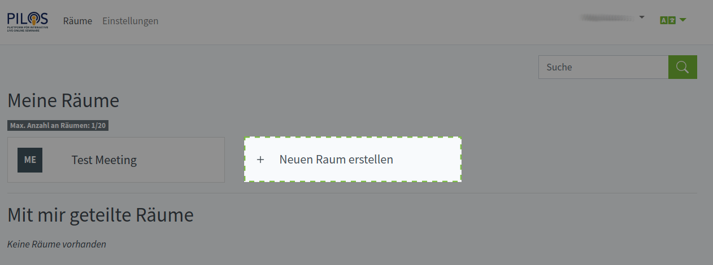
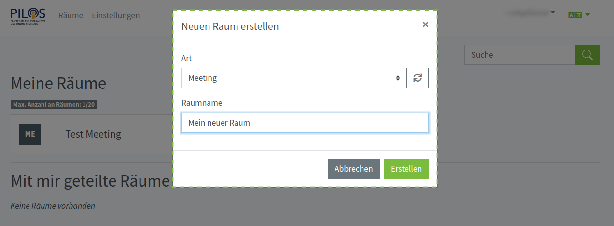

Klicken Sie auf Ihrer [persönlichen Startseite](own) unter dem Abschnitt "Meine Räume" auf "Neuen Raum erstellen".

:::note

Sie können keinen neuen Raum erstellen, wenn:
* Sie haben die maximale Anzahl an Räumen erreicht haben.
* Sie sind nicht die erforderlichen Berechtigungen dafür haben.

:::

In dem sich öffnenden Popup-Fenster wählen Sie die gewünschte Raumart aus, legen einen Namen für den Raum fest und klicken auf "Erstellen".

:::info Mehr erfahren 

[Welche Raumarten gibt es?](types)

:::
