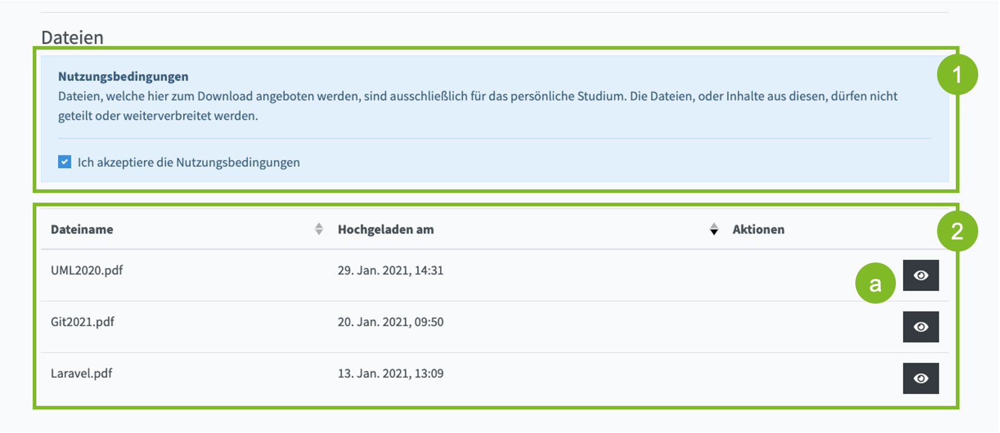
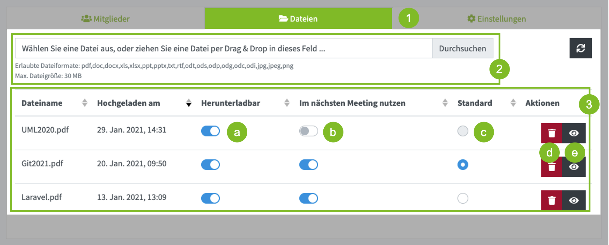

Über die Dateiverwaltung können Präsentationen, Grafiken und Textdateien für die Nutzung in dem Videokonferenzraum bereitgestellt werden.
Die Dateien können den Teilnehmern zusätzlich jederzeit zum Download bereitgestellt werden (z.B. Vorlesungsunterlagen oder Gesprächsprotokolle).

### Ansicht für Teilnehmer, Moderatoren und Gäste

Die Dateiliste (2) wird allen Nutzern angezeigt, die Zugriff auf den Raum haben und diesem beitreten können.
In der Dateiliste werden nur Dateien angezeigt, die der Raumeigentümer für den Download freigegeben hat.

#### Nutzungsbedingungen

Bevor Teilnehmer Dateien herunterladen dürfen, müssen diese den Nutzungsbedingungen (1) zustimmen.

:::info Aktuell gültige Nutzungsbedingungen

Dateien, welche hier zum Download angeboten werden, sind ausschließlich für das persönliche Studium. Die Dateien, oder Inhalte aus diesen, dürfen nicht geteilt oder weiterverbreitet werden.

:::

#### Herunterladen/Anzeigen

1. Stimmen Sie den Nutzungsbedingungen (1) zu.
3. Klicken Sie auf den Button mit dem Augen-Symbol (a).

### Ansicht für Raumeigentümer

Als Eigentümer eines Raumen finden Sie die Dateiverwaltung unter dem Abschnitt Dateien (1).
Alle von Ihnen hochgeladenen Dateien werden in einer Liste (3) angezeigt.

#### Neue Datei hochladen

Um eine neue Datei hochzuladen, ziehen Sie diese Datei entweder mit Drag&Drop in das Eingabefeld (2) oder klicken auf "Durchsuchen" und wählen eine Datei aus.

Beachten Sie die erlaubten Dateiformate und Größenbeschränkung!

:::tip Office Dateien

Office Dateien, die Sie in einem Meeting nutzen wollen (Word, Excel, PowerPoint) werden mit einer Version von Open Office in Vektorgrafiken umgewandelt. Dabei gehen alle Animationen und Übergänge verloren.
Werden bestimmte Funktionen von der Open Office Version nicht unterstützt, kann auch die Darstellung eingeschränkt sein.

**Es wird dringend empfohlen Vorlesungsfolien vor dem Hochladen, als PDF Datei abzuspeichern und diese hochzuladen.**

:::

 

#### Einstellungen

* **Herunterladbar (a)** Alle Benutzer die Zugriff auf diesen Raum haben können die Datei herunterladen (siehe Ansicht für Teilnehmer, Moderatoren und Gäste)
* **Im nächsten Meeting nutzen (b)** Beim Start der nächsten Videokonferenz dieses Raumes wird die Datei in den Konferenzraum geladen und kann dort genutzt werden
* **Standard (c)** Die Datei wird bei der nächsten Videokonferenz der Standard-Foliensatz sein und wird zu Beginn automatisch angezeigt

*Alle Einstellungen die Sie ändern werden automatisch gespeichert.*

#### Herunterladen/Anzeigen

Sie können sich alle Dateien anzeigen lassen, bzw. diese herunterladen. Klicken Sie dafür das den Button mit dem Augen-Symbol (e).

#### Löschen

Möchten Sie eine Datei nicht mehr zum Herunterladen breitstellen und auch in keiner künftigen Videokonferenz nutzen wollen, können Sie die Datei löschen. Klicken Sie dafür das den Button mit dem Mülleimer-Symbol (d).