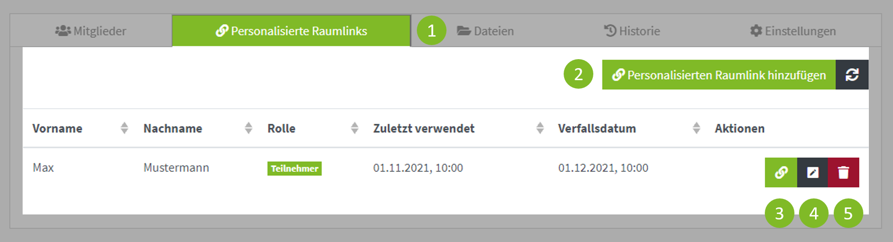

Mit personalisierten Raumlinks können Sie Einzelpersonen, die keine Mitglieder der THM sind, Zugriff auf Ihren Raum geben.
Die Nutzer haben einen festgelegte Namen und Rolle und werden innerhalb der Videokonferenz als reguläre Nutzer und nicht als Gäste behandelt.
Aus diesem Grund haben die Raumeinstellungen 'Gäste zulassen', 'Zugangscode' und 'Warteraum, aktiviert für Gäste' keinen Effekt.

:::tip 

Sollten Sie einer ganzen Gruppe Zugriff gestatten wollen, nutzen Sie besser die Funktion '[Gäste zulassen](../settings#sicherheit)' in den Raumeinstellungen.

:::

### Personalisierten Raumlink erstellen

Um einen neuen personalisierten Raumlink zu erstellen, wählen Sie zunächst auf der Seite des Raumes den Reiter "Personalisierte Raumlinks" (1) aus.
Anschließend klicken Sie auf den Button "Personalisierten Raumlink hinzufügen" (2), es öffnet sich ein Dialogfenster.

Tragen Sie hier den Namen des Gasts ein, dieser kann den Namen später nicht ändern und tritt mit diesem der Videokonferenz bei.
Außerdem können Sie hier die Rolle für die Videokonferenz festlegen.
Bestätigen Sie die Eingaben mit einem Klick auf "Speichern".

Der neue Eintrag wird Ihnen in der Tabelle angezeigt. Um den Zugang an den Gast weitergeben zu können, klicken Sie auf den Button mit dem Hyperlink-Symbol (3).
Der Link wird Ihnen automatisch in die Zwischenablage kopiert und Sie können diesen in einer Email oder einem Chat-Programm einfügen.

### Personalisierten Raumlink verwalten

Um den Namen oder die Rolle eines Links zu verändern, klicken Sie auf das Bearbeiten-Symbol. Es öffnet sich das gleiche Diaglogfenster, wie für das Erstellen eines Links.
Ändern Sie die gewünschen Einstellungen und speichern Sie die Änderungen mit einem Klick auf "Speichern".

Die Raumlinks haben nur eine begrenze Lebensdauer, welche sich nach der letzten Nutung richtet (aktuell 6 Monate). 
Nach dem Verfallsdatum wird der Link gelöscht. Sollten Sie einen Link vor Ablauf des Verfallsdatums löschen möchten, können Sie dies mit einem Klick auf das Mülleimer-Symbol (5) machen.