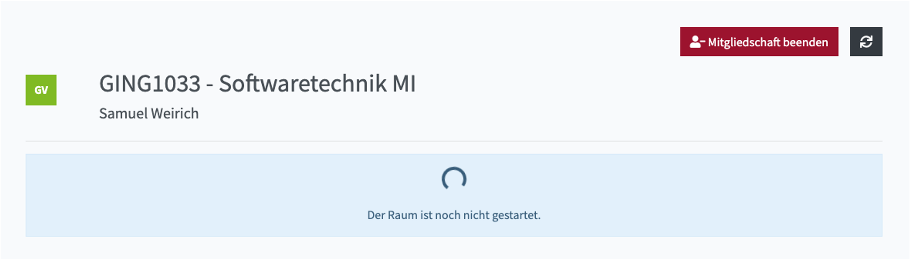
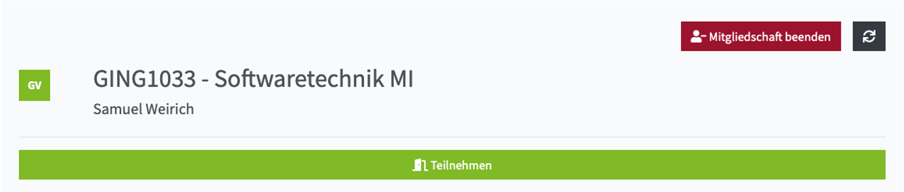

Die primäre Funktion eines Raums in PILOS ist die Bereitstellung von Videokonferenzräumen für die Lehre, Besprechungen, Kleingruppen, u.v.m.

### Starten

Wenn die Videokonferenz noch nicht gestartet wurde können Sie mit einem Klick auf "Starten" die Videokonferenz starten und dem Videokonferenzraum beitreten.

:::note Berechtigung

Die Videokonferenz kann immer von dem Eigentümer des Raums und den Moderatoren gestartet werden.

:::

:::info Mehr erfahren

[Teilnehmern erlauben die Konferenz selbständig zu starten](../settings#berechtigungen)

:::

Wenn die Videokonferenz noch nicht gestartet wurde und Sie nicht die Berechtigung haben die Videokonferenz zu starten, sehen Sie einen Ladekreis und die Meldung "Der Raum ist noch nicht gestartet.".

### Beitreten

Wenn die Videokonferenz läuft, können Sie mit einem Klick auf "Teilnehmen" dem Videokonferenzraum beitreten. Gäste (Personen ohne Benutzerkonto) müssen vor Beitritt Ihren Namen in ein Eingabefeld eintragen und können anschließen dem Videokonferenzraum beitreten.

:::info Mehr erfahren

[Bedienung der Videokonferenzoberfläche BigBlueButton](../../bbb/).

:::