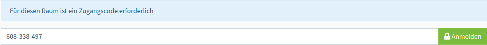
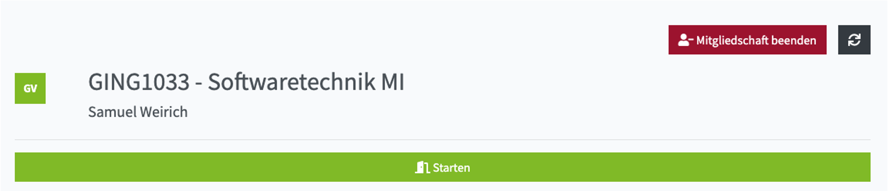
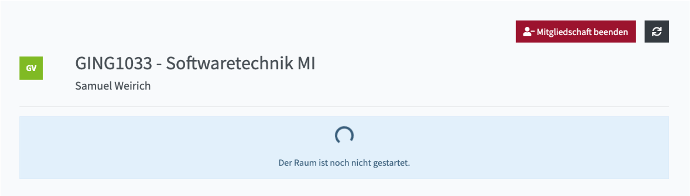
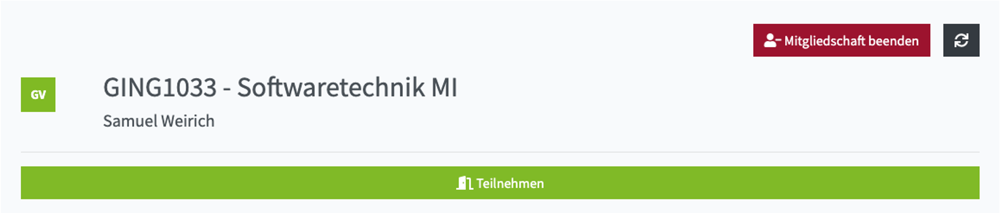

Sie können einem Raum über unterschiedliche Wege beitreten:

1. Sie sind der Eigentümer des Raumes: Sie finden alle Ihre Räume auf Ihrer [persönlichen Startseite](own).
2. Sie sind Mitglied in dem Raum: Sie finden alle Ihre Raummitgliedschaften auf Ihrer [persönlichen Startseite](own).
3. Sie möchten einen öffentlich gelisteten Raum finden: Nutzen Sie die [Raumsuche](list).
4. Sie haben einen Link erhalten: Lesen Sie [hier](#mit-link-beitreten) weiter.

Manche Räume sind durch einen Zugangscode geschützt. Wenn Sie kein Mitglied des Raumes sind, müssen Sie den Zugangscode eingeben, um in den Raum zu gelangen.

:::info Mehr erfahren

[Zugangscode ändern/löschen](settings)

:::

### Mit Link beitreten
Wenn Sie eine Einladung für einen Raum erhalten haben, fügen Sie den Link in die Adresszeile Ihres Webbrowsers ein.

:::info 

Falls Sie die Meldung 'Dieser Raum kann nur von angemeldeten Nutzern verwendet werden' angezeigt bekommen, müssen Sie sich in PILOS anmelden.
Sollten Sie kein Benutzerkonto haben, können Sie diesen Raum leider nicht nutzen.

:::

:::info Mehr erfahren

[Raum für Gäste freigeben](settings#sicherheit)

:::

## Videokonferenz starten

Wenn die Videokonferenz noch nicht gestartet wurde, können Sie mit einem Klick auf "Starten" die Videokonferenz starten und dem Videokonferenzraum beitreten.

:::note Berechtigung

Die Videokonferenz kann immer von dem Eigentümer des Raums und den Moderatoren gestartet werden.

:::

:::info Mehr erfahren

[Teilnehmern erlauben die Konferenz selbständig zu starten](settings#berechtigungen)

:::

Wenn die Videokonferenz noch nicht gestartet wurde und Sie nicht die Berechtigung haben die Videokonferenz zu starten, sehen Sie einen Ladekreis und die Meldung "Der Raum ist noch nicht gestartet.".

## Videokonferenz beitreten

Wenn die Videokonferenz läuft, können Sie mit einem Klick auf "Teilnehmen" dem Videokonferenzraum beitreten. Gäste (Personen ohne Benutzerkonto) müssen vor Beitritt Ihren Namen in ein Eingabefeld eintragen und können anschließen dem Videokonferenzraum beitreten.

