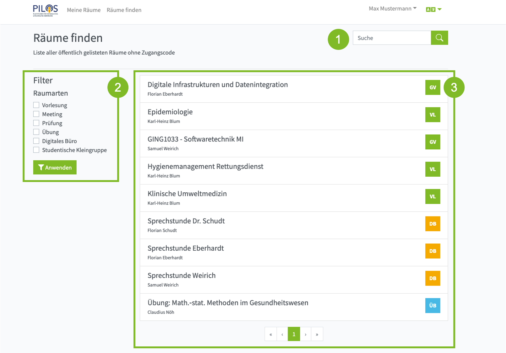

Um die Raumsuche zu öffnen, klicken Sie oben in der Menüleiste auf den Eintrag "Räume finden". 

### (1) Suche

Die Anzahl der Räume in der Raumsuche kann es schwierig machen den gesuchten Raum zu finden. In das Suchfeld (oben rechts) können Sie den Namen des Eigentümers und/oder den Namen des Raumes eingeben.
Sie können auch nur Fragmente des Suchbegriffs eingeben und Begriffe kombinieren. Wenn Sie Begriffe kombinieren, trennen Sie die einzelnen Wörter mit einem Leerzeichen. Damit ein Eintrag in den Ergebnissen angezeigt wird, müssen alle Begriffe mind. einmal im Namen des Eigentümers oder dem Namen des Raumes vorkommen.

### (2) Filter

Wenn die Eingrenzung der Ergebnisse durch die Suche nicht ausreicht oder für Ihr Anliegen unpassend ist, können Sie auch ein oder mehrere Raumarten auf der linken Seite auswählen und mit einem Klick auf "Anwenden" die Ergebnisse nach den ausgewählen Raumarten filtern.

Filter und Suche können kombiniert werden.

### (3) Liste der Räume

Auf der rechten Seite werden Ihnen alle Räume, welche für die Raumsuche freigeschaltet sind, angezeigt. Wenn Sie einen Suchbegriff eingegeben oder ein Filter angewandt haben, werden die Ergebnisse eingeschränkt.

Werden mehr Räume gefunden als auf einer Seite darstellbar, können Sie über die Navigation am Ende der Liste zwischen verschiedenen Seiten wechseln.

#### Raum beitreten
Um einen Raum zu öffnen, klicken Sie auf den gewünschten Eintrag in der Liste.

#### Freischalten
Raumeigentümer können Ihren Raum für die Raumsuche freischalten. Das eignet sich besonders für digitale Büros, aber auch über Vorlesungen die allen Mitgliedern der THM offen stehen sollen.

:::info Mehr erfahren

[Raum für Raumsuche freischalten](settings#sicherheit)

:::
