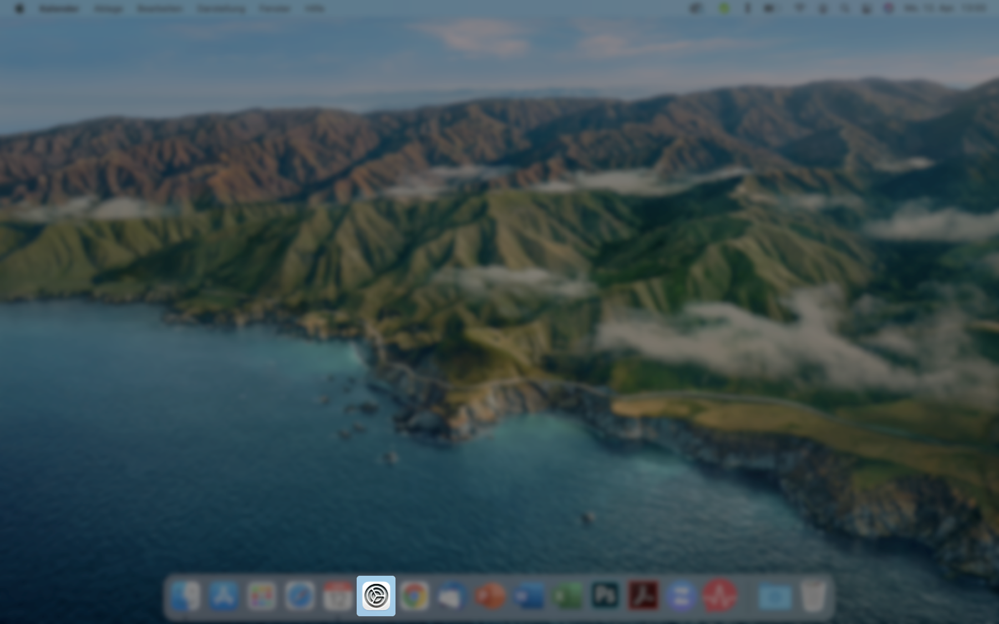
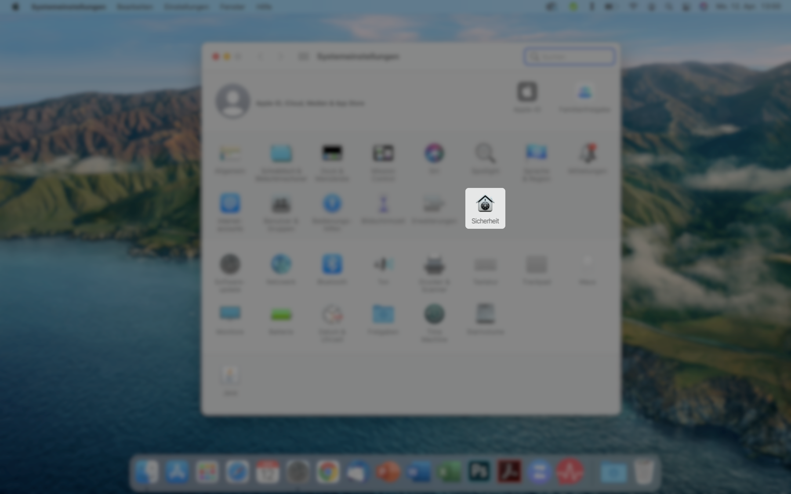
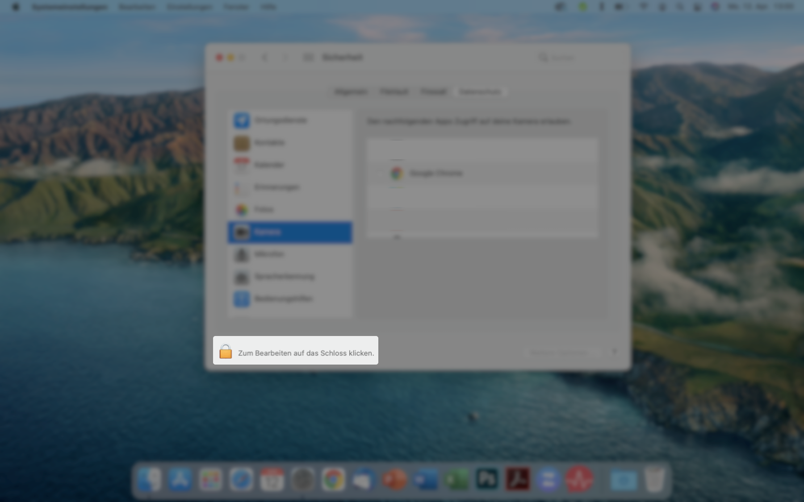
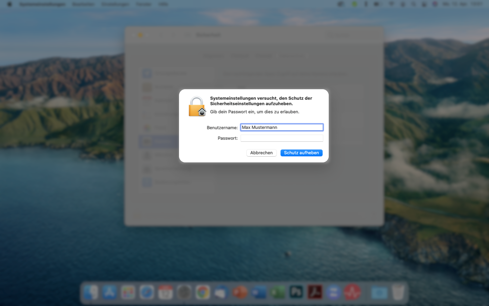
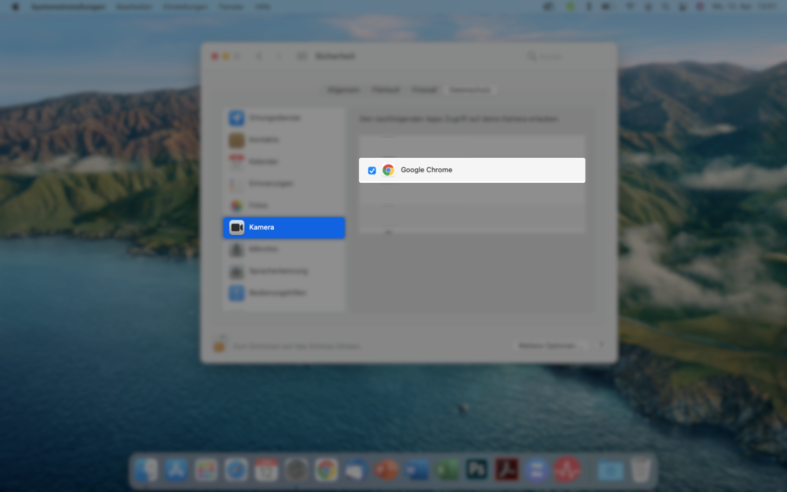
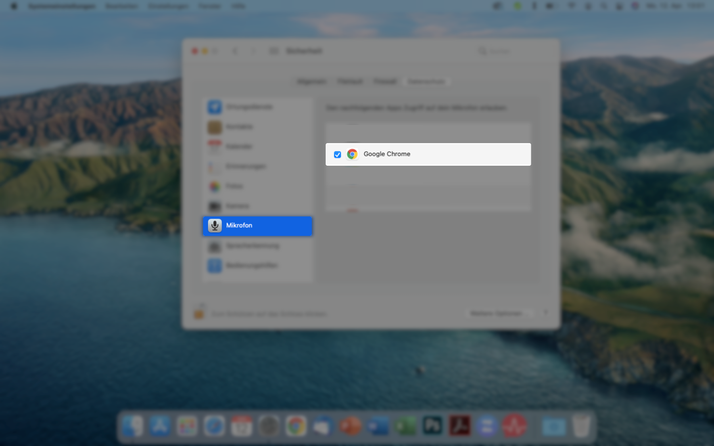
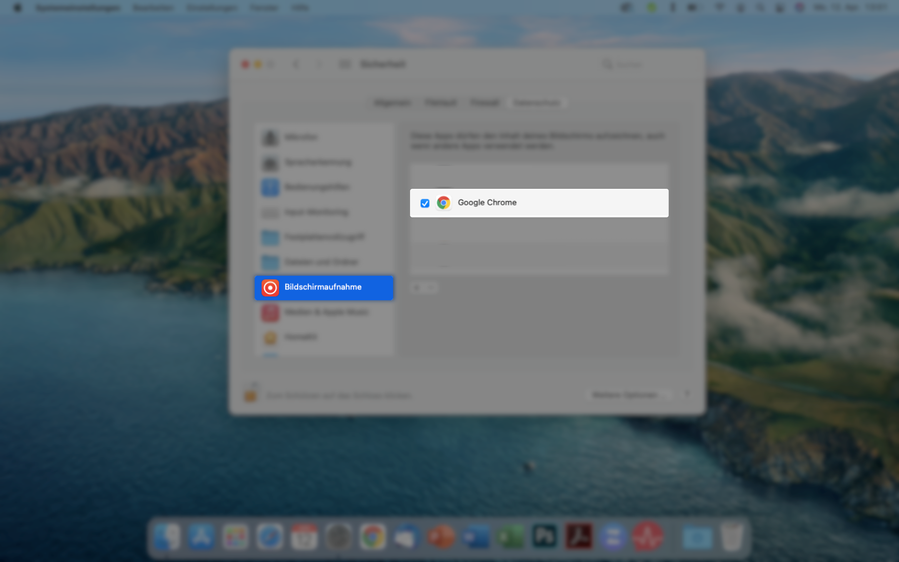
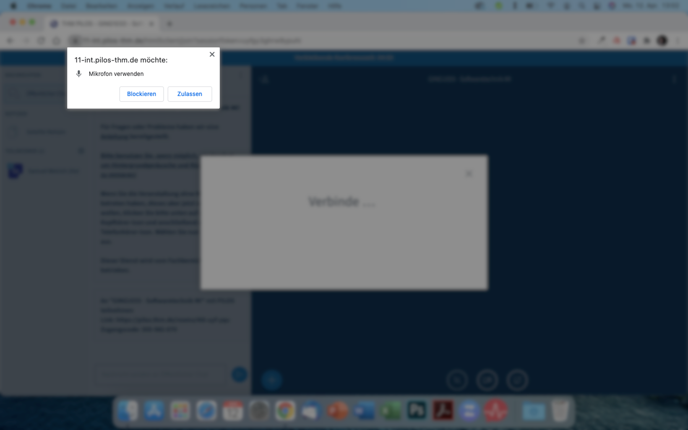
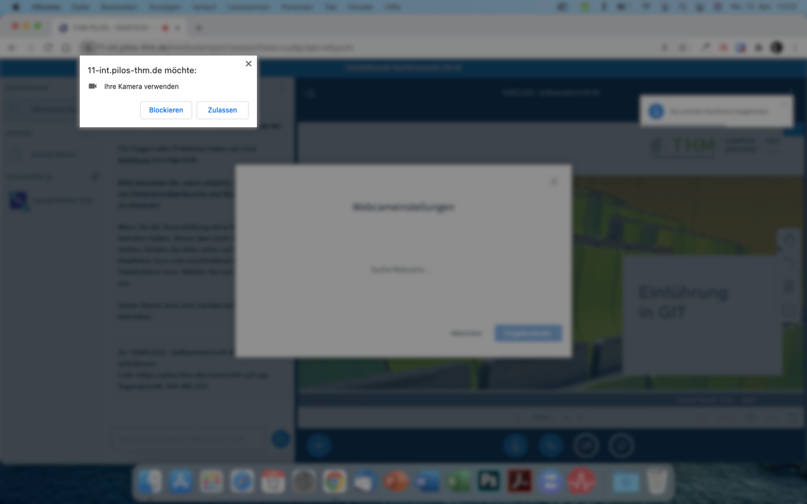

## Sicherheitseinstellungen - macOS Big Sur - Google Chrome

### Einstellungen öffnen

Klicken Sie im Dock auf das Zahnrad-Symbol. Sollten Sie das Symbol nicht im Dock haben, können Sie auch mit der Tastenkombination cmd ⌘ + Leertaste die Sportlight-Suche öffnen. Dort suchen Sie nach dem Begriff "Systemeinstellungen" und wählen den ersten Eintrag aus.

### Sicherheit auswählen

In den Systemeinstellungen klicken Sie auf den Eintrag "Sicherheit".

### Schutz aufheben

Um die Einstellungen bearbeiten zu können, müssen Sie die Schutz aufheben. Klicken Sie dafür unten links auf das Schloss.

### Sperre aufheben

Geben Sie die Anmeldedaten für Ihr Benutzerkonto ein und klicken auf "Schutz aufheben".

### Kamera freigeben

Wählen Sie auf der linken Seite den Eintrag "Kamera" aus und setzen einen blauen Haken vor dem von Ihnen für die Videotelefonie genutzten Webbrowser.

### Mikrofon freigeben

Wählen Sie auf der linken Seite den Eintrag "Mikrofon" aus und setzen einen blauen Haken vor dem von Ihnen für die Videotelefonie genutzten Webbrowser.

### Bildschirmübertragung freigeben

Scrollen Sie auf der linken Seite ein wenig nach unten, wählen den Eintrag "Bildschirmaufnahme" aus und setzen einen blauen Haken vor dem von Ihnen für die Videotelefonie genutzten Webbrowser.

### Mikrofonzugriff im Browser erlauben

Nachdem Sie die Sicherheitseinstellungen vorgenommen haben, starten Sie Ihren Webbrowser neu. Wenn Sie in der Videokonferenz Ihr Mikrofon verwenden möchten und dem Meeting mit Mikrofon beitreten, öffnet sich eine Abfrage des Webbrowsers. Bestätigen Sie den Zugriff auf das Mikrofon mit einem Klick auf "Zulassen".

### Kamera im Browser erlauben

Wenn Sie in der Videokonferenz Ihre Kamera freigeben, öffnet sich eine Abfrage des Webbrowsers. Bestätigen Sie den Zugriff auf die Kamera mit einem Klick auf "Zulassen".