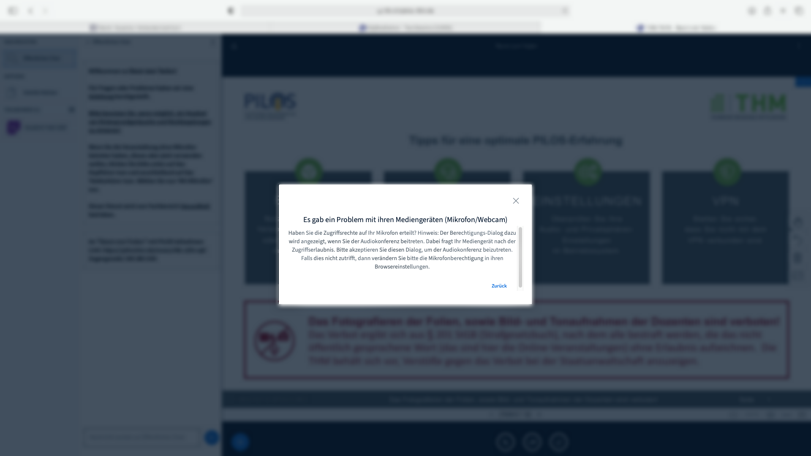
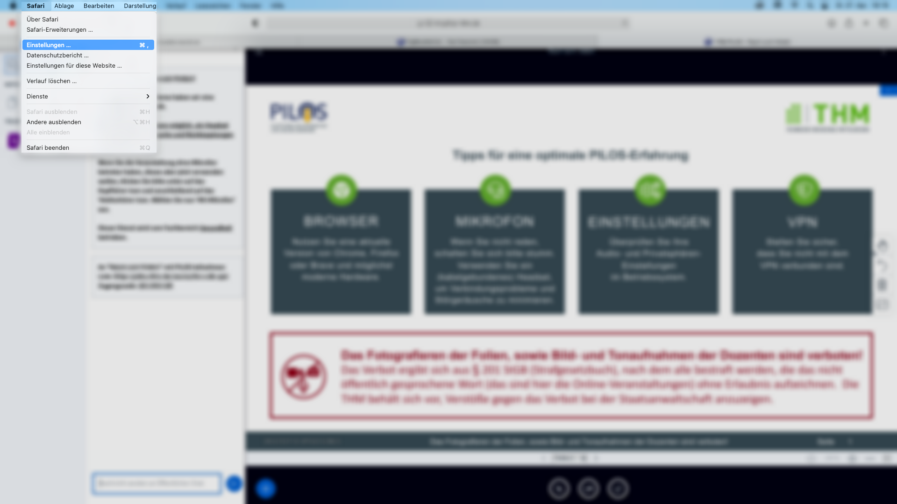
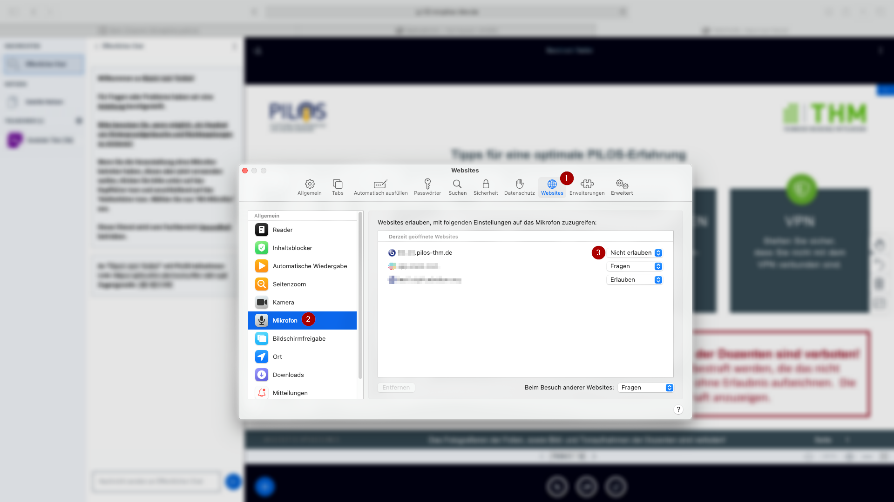
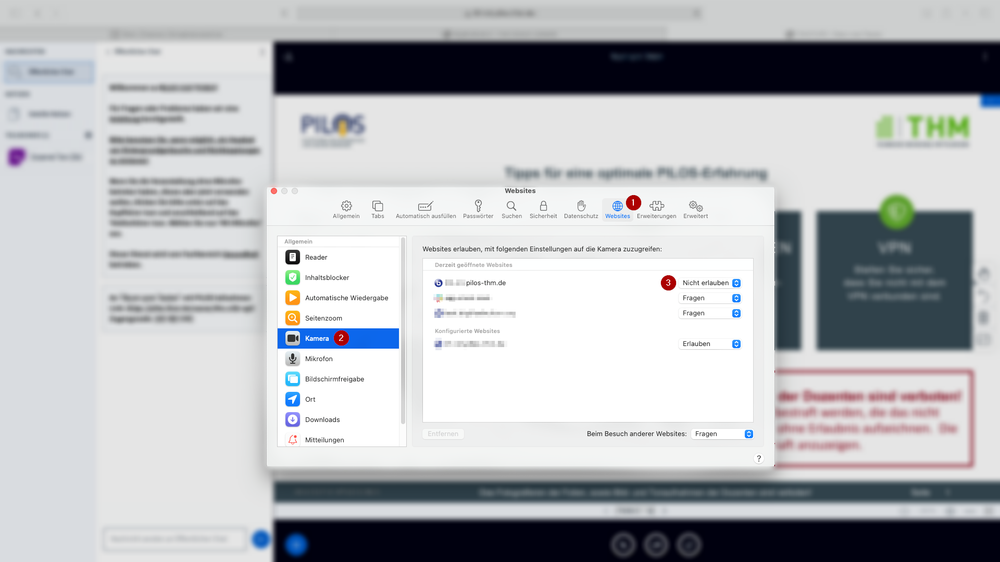
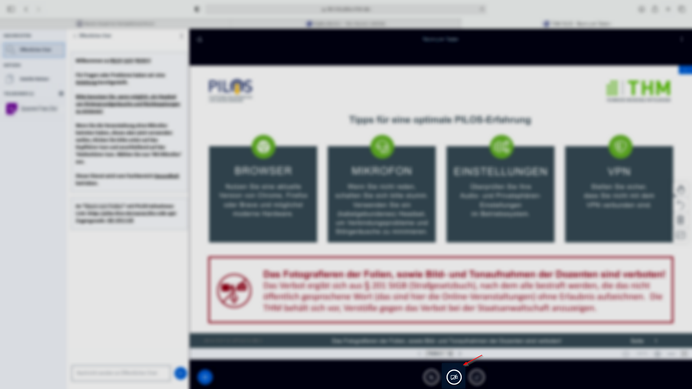
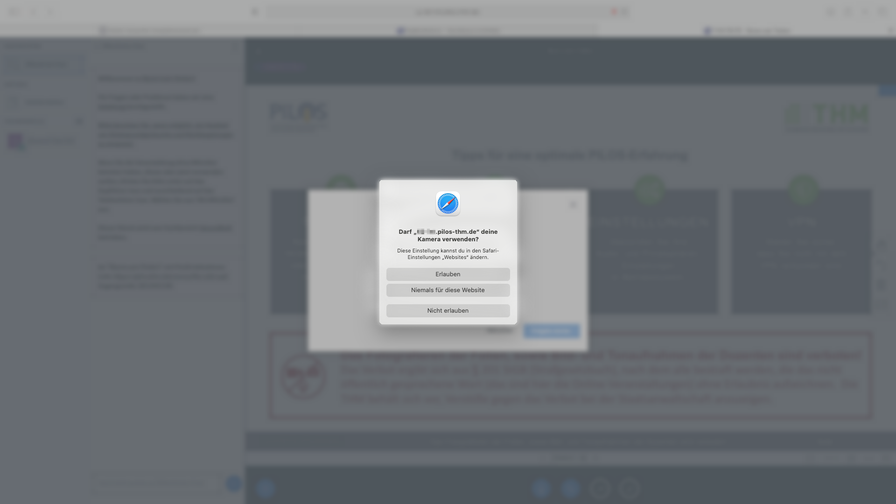
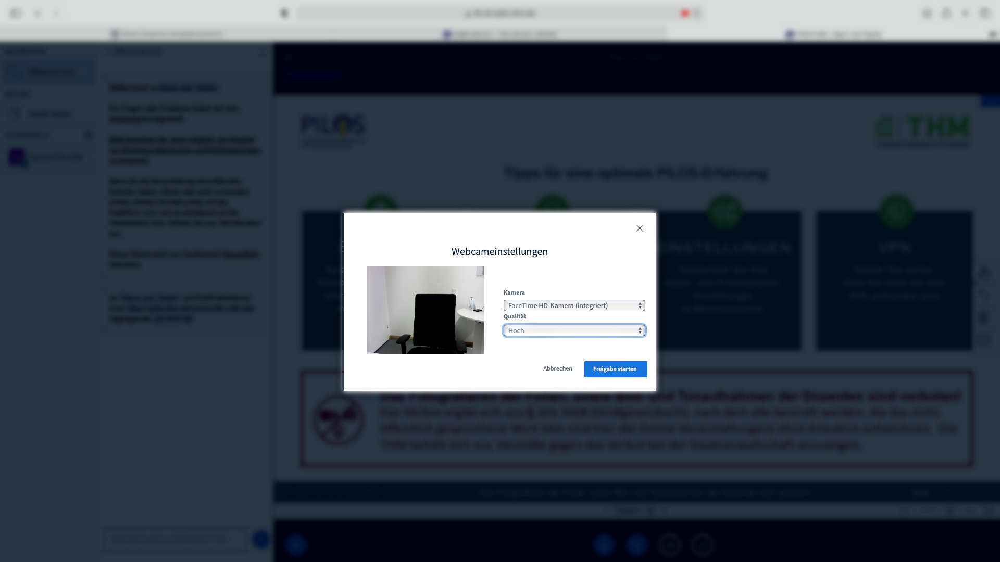
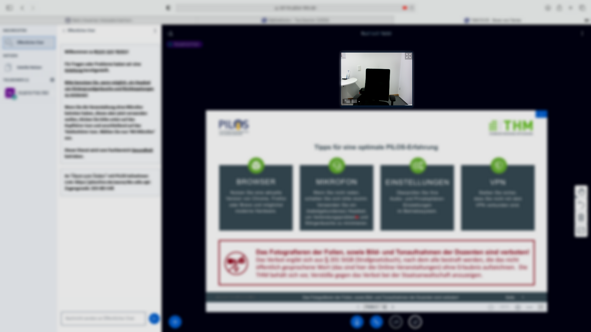

## Sicherheitseinstellungen

### Mikrofon testen

Klicken Sie im Auswahlfenster auf das Mikrofon-Symbol "Mit Mikrofon", damit Safari Ihre Zugriffsrechte auf Ihr Mikrofon überprüfen kann.
Sofern die Fehlermeldung "Es gab ein Problem mit ihren Mediengeräten (Mikrofon/Webcam)" erscheint, fahren Sie mit Schritt 2 fort.
Ansonsten springen Sie direkt zu Schritt 5.

### Einstellung öffnen

Fahren Sie mit der Maus oben links auf "Safari" und dann auf "Einstellungen".

### Zugriffsberechtigung für Mikrofon/ Kamera testen

Klicken Sie auf den Reiter "Websites". Wählen Sie auf der linken Seite jeweils die Einträge "Mikrofon" und "Kamera" aus. Bei der Auflistung der Webseiten sollte die Berechtigung für die Videokonferenzseite auf "Erlaubt" oder "Fragen" gesetzt werden.

### Seite aktualisieren

Aktualisieren Sie die Seite der Videokonferenz.

### Webcam freigeben

Klicken Sie auf das Webcam-Symbol.
Sofern in Ihrer Browsereinstellung die Zugriffsberechtigung für die Webcam auf "Fragen" einstellt worden ist, erscheint bei Ihnen ein Fenster, welches um die Verwendung der Kamera bittet.
Sollte die Zugriffsberechtigung für die Webcam auf "Erlauben" gesetzt worden sein, erscheint bei Ihnen ein Fenster für die Einstellung der Webcam. Passen Sie je nach Wunsch die Qualität der Webcam an und bestätigen Sie dies mit "Freigabe starten".
Sie sollten bei einer erfolgreichen Verbindung ein Videobild von sich selber sehen können.