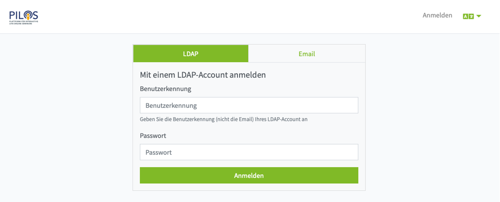
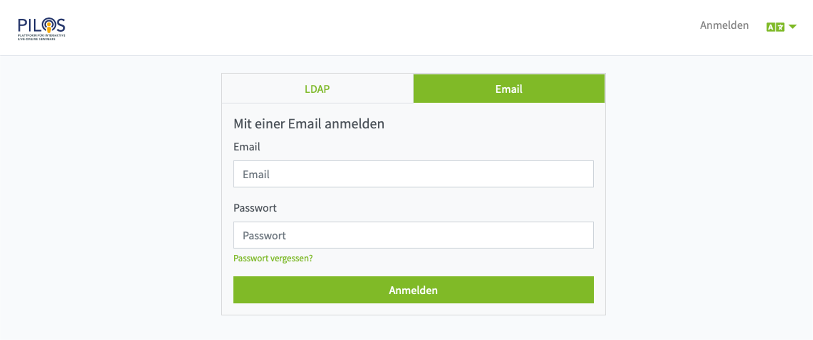

Um die meisten Funktionen PILOS verwenden zu können, müssen Sie sich mit Ihrem Benutzerkonto anmelden.
Für die Anmeldung stehen Ihnen zwei verschiedene Arten zur Verfügung:

## LDAP

Wenn Sie Student oder Mitarbeiter an der THM sind, können Sie sich mit Ihrer THM Benutzerkennung und Ihrem Passwort hier anmelden.

:::info 

[Was ist meine THM-Benutzerkennung?](https://www.thm.de/its/helpdesk-rechenzentrum/faq.html#wie-sieht-die-thm-benutzerkennung-aus)

:::

## Email

Wenn Sie keine THM Benutzerkennung haben oder Sie Problem mit dem LDAP Login haben, kann das Support-Team Ihnen ein Benutzerkonto für den Email Login erstellen.

Sollten Sie Ihr Passwort vergessen haben, können Sie sich mit einem Klick auf "Passwort vergessen?" einen Link für die Passwortzurücksetzung an Ihre eMail-Adresse schicken lassen.

