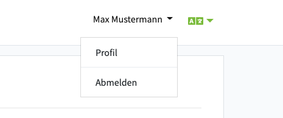
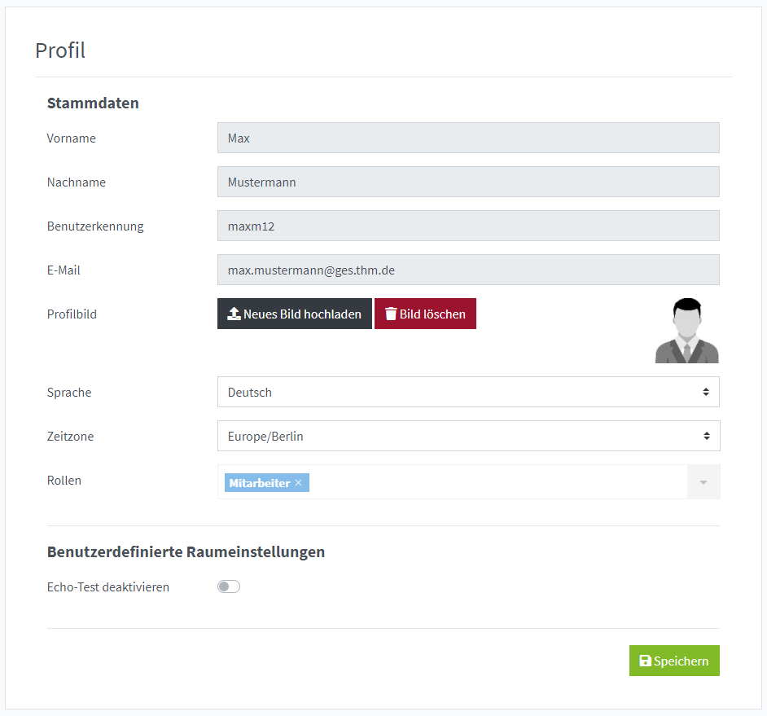
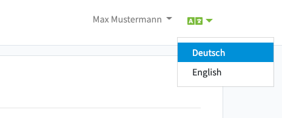

Sie können Ihr Benutzerprofil öffnen, indem Sie in der Menüleiste oben rechts auf Ihren eigenen Namen klicken.
In dem sich öffnenden Dropdown-Menü wählen Sie den Eintrag "Profil" aus.

## Stammdaten ändern

Wenn Sie ein Benutzerkonto ohne LDAP haben und Ihre Berechtigungen es zulassen, können Sie Ihren Vor- und Nachnamen und eMail-Adresse ändern.
Sollte die Ihnen automatisch zugewiesene Rolle Ihrer Meinung nach falsch sein, kontaktieren Sie bitte den Support.

In dieser Ansicht können Sie ebenfalls Ihre Zeitzone einstellen, in diesem Fall werden die Datum- und Uhrzeitangaben in PILOS und in Emails in der gewünschten Zeitzone angezeigt.

## Profilbild ändern

Sie können Ihrem Benutzerkonto ein Profilbild hinzufügen. Dieses wird in der Videokonferenz neben Ihrem Namen angezeigt. Auch wird es für den Raumeigentümer und die Miteigentümer in der Liste der Raummitglieder dargestellt.
Das Bild können Sie jederzeit löschen oder durch ein anderes Bild ersetzen.

Wenn Sie ein neues Bild hochladen (png oder jpg) können Sie es über eine Dialogbox auf das Format 1x1 zuschneiden.

## Passwort ändern

Benutzer ohne LDAP können Ihr Passwort in PILOS selbständig ändern. LDAP Nutzer müssen das Passwort in der Passwortverwaltung der Hochschule ändern lassen.

:::info Passwortrichtlinie

* Passwort muss mindestens 8 Zeichen lang sein
* Das Passwort muss mindestens ein Zeichen aus jeder der folgenden vier Kategorien enthalten:
  * Großbuchstaben (A - Z)
  * Kleinbuchstaben (a - z)
  * Zahlen (0 - 9)
  * nicht alphanumerisches Zeichen (zum Beispiel: !, $, #, oder %)

:::

## Sprache ändern

Sie können jederzeit Ihre bevorzugte Sprache über die Menüleiste ändern.

Alternativ können Sie die Sprache auch in Ihrem Benutzerprofil ändern.

## Echo-Test deaktivieren

Der Echo-Test wird standardmäßig bei jedem Beitritt in eine Videokonferenz durchgeführt und hilft Probleme mit dem Mikrofon und den Lautsprechern frühzeitig zu erkennen und zu beheben.
Um diesen regelmäßigen Test zu umgehen, aktivieren Sie den Schalter "Echo-Test deaktivieren".