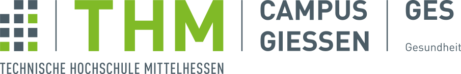

# Bulma Clean Theme demo website

This website showcases the options for the Bulma Clean theme. The theme is available as a ruby gem or can be used with GitHub pages.

[](https://badge.fury.io/rb/bulma-clean-theme)


## Ruby Gem

The ruby gem is available on the Ruby Gems website at the following location. [https://rubygems.org/gems/bulma-clean-theme](https://rubygems.org/gems/bulma-clean-theme).

## GitHub Pages

The theme can be used with GitHub Pages by setting the `remote_theme` in your Jekyll sites `_config.yml`

```yml
remote_theme: chrisrhymes/bulma-clean-theme
```

## Instructions

For full instructions, please see the Readme at the GitHub repo:
[https://github.com/chrisrhymes/bulma-clean-theme/blob/master/README.md](https://github.com/chrisrhymes/bulma-clean-theme/blob/master/README.md)

## Page Layouts

This demo site showcases the available page layout options.

* Page With Sidebar
* Page Without Sidebar
* Page With Menubar
* Page With Tabs
* Page Without Footer
* Page Without Hero
* Page With Contents
* Landing Page With Callouts
* Sponsors Page
* Image Gallery
* Blog
* Post

## Entwickelt von der Technischen Hochschule Mittelhessen

PILOS wurde vom Fachbereich Gesundheit für die Bedürfnisse der Studierenden und Lehrenden während der Corona-Pandemie entwickelt.

<a href="https://www.thm.de/ges/" target="_blank"></a>
